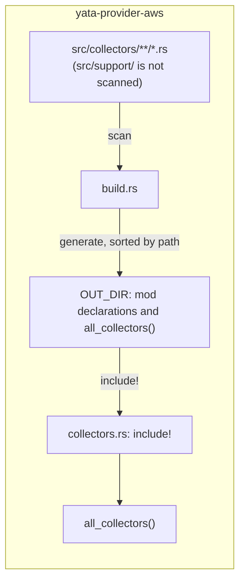

# Build-Time Discovery

```mermaid
flowchart LR
    subgraph awsc["yata-provider-aws"]
        coll["src/collectors/**/*.rs<br/>(src/support/ is not scanned)"]
        ba["build.rs"]
        outa["OUT_DIR: mod declarations and all_collectors()"]
        liba["collectors.rs: include!"]
        all["all_collectors()"]
        coll -->|scan| ba
        ba -->|generate, sorted by path| outa
        outa -->|include!| liba
        liba --> all
    end
```
