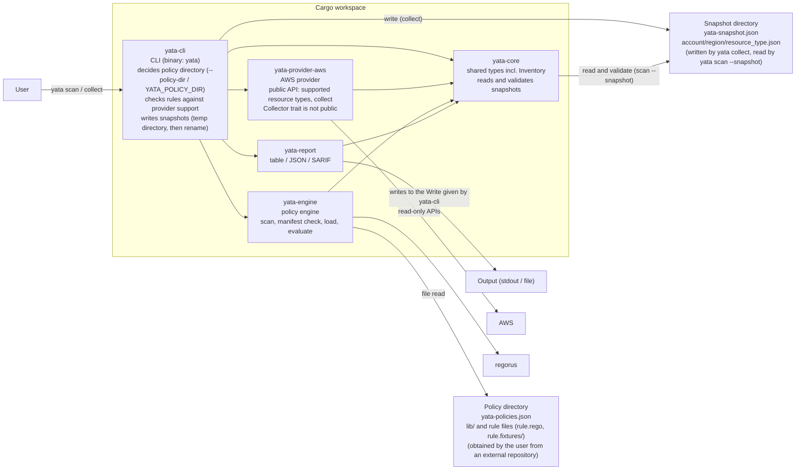

# Component Overview

```mermaid
flowchart LR
    user["User"]
    out["Output (stdout / file)"]
    aws["AWS"]
    regorus["regorus"]
    pd["Policy directory<br/>yata-policies.json<br/>lib/ and rule files (rule.rego, rule.fixtures/)<br/>(obtained by the user from an external repository)"]
    sd["Snapshot directory<br/>yata-snapshot.json<br/>account/region/resource_type.json<br/>(written by yata collect, read by yata scan --snapshot)"]

    subgraph workspace["Cargo workspace"]
        cli["yata-cli<br/>CLI (binary: yata)<br/>decides policy directory (--policy-dir / YATA_POLICY_DIR)<br/>checks rules against provider support<br/>writes snapshots (temp directory, then rename)"]
        aws_crate["yata-provider-aws<br/>AWS provider<br/>public API: supported resource types, collect<br/>Collector trait is not public"]
        engine["yata-engine<br/>policy engine<br/>scan, manifest check, load, evaluate"]
        report["yata-report<br/>table / JSON / SARIF"]
        core["yata-core<br/>shared types incl. Inventory<br/>reads and validates snapshots"]
    end

    user -->|"yata scan / collect"| cli
    cli --> aws_crate
    cli --> engine
    cli --> report
    cli --> core
    aws_crate --> core
    engine --> core
    report --> core

    aws_crate -->|"read-only APIs"| aws
    engine --> regorus
    engine -->|"file read"| pd
    cli -->|"write (collect)"| sd
    core -->|"read and validate (scan --snapshot)"| sd
    report -->|"writes to the Write given by yata-cli"| out
```
