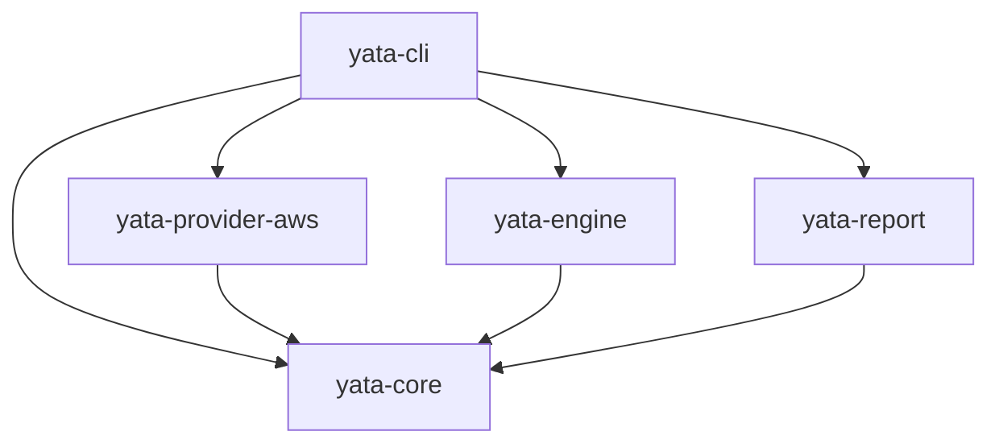

# Crate Dependencies

```mermaid
flowchart TD
    cli["yata-cli"]
    aws["yata-provider-aws"]
    engine["yata-engine"]
    report["yata-report"]
    core["yata-core"]

    cli --> aws
    cli --> engine
    cli --> report
    cli --> core
    aws --> core
    engine --> core
    report --> core
```
