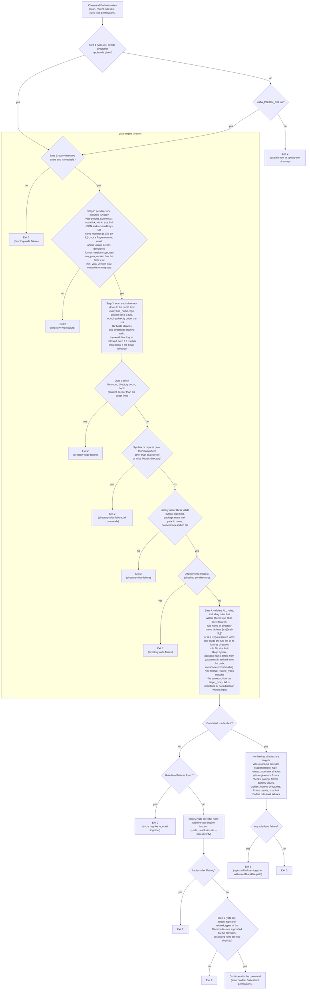

# Policy Loading

```mermaid
flowchart TD
    start["Command that uses rules<br/>(scan, collect, rules list, rules test, permissions)"] --> d1{"Step 1 (yata-cli): decide directories<br/>--policy-dir given?"}
    d1 -->|yes| ex
    d1 -->|no| d2{"YATA_POLICY_DIR set?"}
    d2 -->|yes| ex
    d2 -->|no| x2a["Exit 2<br/>(explain how to specify the directory)"]

    subgraph engine["yata-engine (loader)"]
        ex{"Step 2: every directory exists and is readable?"} -->|no| x2b["Exit 2<br/>(directory-wide failure)"]
        ex -->|yes| man{"Step 2: per directory, manifest is valid?<br/>yata-policies.json exists, not a link, within size limit<br/>JSON and required keys OK<br/>name matches [a-z][a-z0-9_]*, not a Rego reserved word,<br/>and is unique across directories<br/>format_version supported<br/>min_yata_version has the form x.y.z<br/>min_yata_version is at most the running yata"}
        man -->|no| x2c["Exit 2<br/>(directory-wide failure)"]
        man -->|yes| scan["Step 3: scan each directory down to the depth limit<br/>every rule_name.rego outside lib/ is a rule,<br/>including directly under the root<br/>lib/ holds libraries<br/>skip directories starting with .<br/>top-level directory is followed even if it is a link<br/>links below it are never followed"]
        scan --> lim{"Over a limit?<br/>file count, directory count, depth<br/>(content deeper than the depth limit)"}
        lim -->|yes| x2l["Exit 2<br/>(directory-wide failure)"]
        lim -->|no| lnk{"Symlink or reparse point found anywhere<br/>other than in a rule file<br/>or in its fixtures directory?"}
        lnk -->|yes| x2k["Exit 2<br/>(directory-wide failure, all commands)"]
        lnk -->|no| lib{"Library under lib/ is valid?<br/>syntax, size limit,<br/>package starts with yata.lib.name,<br/>no metadata and no fail"}
        lib -->|no| x2m["Exit 2<br/>(directory-wide failure)"]
        lib -->|yes| zero{"Directory has 0 rules?<br/>(checked per directory)"}
        zero -->|yes| x2d["Exit 2<br/>(directory-wide failure)"]
        zero -->|no| val["Step 4: validate ALL rules, including rules that<br/>will be filtered out. Rule-level failures:<br/>rule name or directory name violates [a-z][a-z0-9_]*<br/>or is a Rego reserved word,<br/>link inside the rule file or its fixtures directory,<br/>rule file size limit,<br/>Rego syntax,<br/>package name differs from yata.rules.ID derived from the path,<br/>metadata error (including type format; related_types must be<br/>the same provider as target_type), fail is undefined or not a boolean without input"]
    end

    val --> mode{"Command is rules test?"}

    mode -->|no| ok1{"Rule-level failures found?"}
    ok1 -->|yes| x2e["Exit 2<br/>(errors may be reported together)"]
    ok1 -->|no| filt["Step 5 (yata-cli): filter rules with the yata-engine function<br/>(--rule, --exclude-rule, --min-severity)"]
    filt --> f0{"0 rules after filtering?"}
    f0 -->|yes| x2f["Exit 2"]
    f0 -->|no| prov{"Step 6 (yata-cli): target_type and related_types of the<br/>filtered rules are supported by the provider?<br/>(excluded rules are not checked)"}
    prov -->|no| x2g["Exit 2"]
    prov -->|yes| cmd["Continue with the command<br/>(scan / collect / rules list / permissions)"]

    mode -->|yes| rtprov["No filtering: all rules are targets<br/>yata-cli checks provider support (target_type, related_types) for all rules<br/>yata-engine runs fixture checks: pairing, format, dummy values,<br/>orphan .fixtures directories, fixture results, size limit<br/>Collect rule-level failures"]
    rtprov --> rtc{"Any rule-level failure?"}
    rtc -->|yes| x1["Exit 1<br/>(report all failures together with rule ID and file path)"]
    rtc -->|no| x0["Exit 0"]
```
