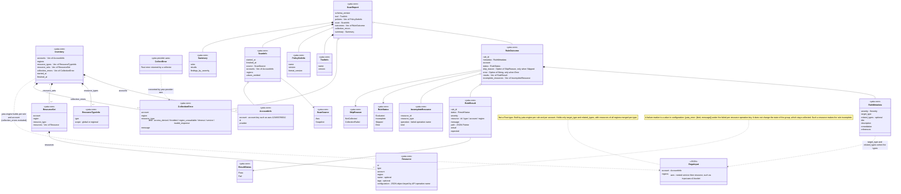

# Resource Model

```mermaid
classDiagram
    class Inventory {
        <<yata-core>>
        accounts : Vec of AccountInfo
        regions
        resource_types : Vec of ResourceTypeInfo
        resource_sets : Vec of ResourceSet
        collection_errors : Vec of CollectionError
        started_at
        finished_at
    }
    class ResourceSet {
        <<yata-core>>
        account
        region
        resource_type
        resources : Vec of Resource
    }
    class AccountInfo {
        <<yata-core>>
        account : account key such as aws-123456789012
        id
        provider
    }
    class ResourceTypeInfo {
        <<yata-core>>
        type
        scope : global or regional
    }
    class Resource {
        <<yata-core>>
        id
        type
        account
        region
        name : optional
        tags : optional
        configuration : JSON object keyed by API operation name
    }
    class CollectionError {
        <<yata-core>>
        account
        region
        resource_type
        kind : access_denied / throttled / region_unavailable / timeout / service / invalid_response
        message
    }
    class CollectError {
        <<yata-provider-aws>>
        Rust error returned by a collector
    }
    class RuleMetadata {
        <<yata-core>>
        severity : Severity
        target_type
        related_types : optional
        title
        description
        remediation
        references
    }
    class RuleOutcome {
        <<yata-core>>
        rule_id
        metadata : RuleMetadata
        account
        status : RuleStatus
        skip_reason : Option of SkipReason, only when Skipped
        error : Option of String, only when Error
        results : Vec of RuleResult
        incomplete_resources : Vec of IncompleteResource
    }
    class IncompleteResource {
        <<yata-core>>
        resource_id
        resource_type
        operation : failed operation name
        kind
    }
    class RuleStatus {
        <<yata-core>>
        Evaluated
        Incomplete
        Skipped
        Error
    }
    class SkipReason {
        <<yata-core>>
        NotCollected
        CollectionFailed
    }
    class RuleResult {
        <<yata-core>>
        rule_id
        status : ResultStatus
        severity
        resource : id / type / account / region
        message
        path : JSON Pointer
        actual
        expected
    }
    class ResultStatus {
        <<yata-core>>
        Pass
        Fail
    }
    class ScanReport {
        <<yata-core>>
        schema_version
        tool : ToolInfo
        policies : Vec of PolicySetInfo
        scan : ScanInfo
        outcomes : Vec of RuleOutcome
        collection_errors
        summary : Summary
    }
    class ToolInfo {
        <<yata-core>>
        name
        version
    }
    class PolicySetInfo {
        <<yata-core>>
        name
        version
        format_version
    }
    class ScanInfo {
        <<yata-core>>
        started_at
        finished_at
        source : ScanSource
        accounts : Vec of AccountInfo
        regions
        values_omitted
    }
    class ScanSource {
        <<yata-core>>
        Aws
        Snapshot
    }
    class Summary {
        <<yata-core>>
        rules
        results
        findings_by_severity
    }
    class RegoInput {
        <<JSON>>
        account : AccountInfo
        regions
        aws : nested service then resource, such as input.aws.s3.bucket
    }
    note for RegoInput "Not a Rust type. Built by yata-engine per rule and per account. Holds only target_type and related_types, with resources of all regions merged per type."
    note for Resource "A failure marker is a value in configuration: {yata_error: {kind, message}} under the failed per-resource operation key. It does not change the state of the group, which stays collected. Such a resource makes the rule incomplete."

    Inventory "1" *-- "1..*" AccountInfo : accounts
    Inventory "1" *-- "0..*" ResourceTypeInfo : resource_types
    Inventory "1" *-- "0..*" ResourceSet : resource_sets
    Inventory "1" *-- "0..*" CollectionError : collection_errors
    ResourceSet "1" *-- "0..*" Resource : resources
    CollectError ..> CollectionError : converted by yata-provider-aws
    Inventory ..> RegoInput : yata-engine builds per rule and account (collection_errors excluded)
    RuleMetadata ..> RegoInput : target_type and related_types select the types
    RuleOutcome *-- RuleMetadata
    RuleOutcome o-- RuleResult
    RuleOutcome o-- IncompleteResource
    RuleOutcome --> RuleStatus
    RuleOutcome --> SkipReason
    RuleResult --> ResultStatus
    ScanReport o-- RuleOutcome
    ScanReport o-- CollectionError
    ScanReport *-- ToolInfo
    ScanReport o-- PolicySetInfo
    ScanReport *-- ScanInfo
    ScanReport *-- Summary
    ScanInfo --> ScanSource
    ScanInfo o-- AccountInfo
```
