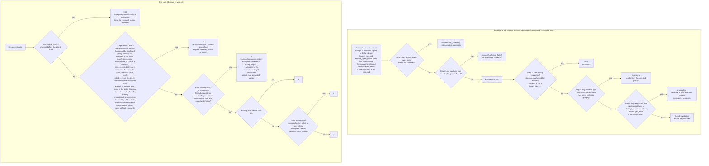

# Rule Status and Exit Code

```mermaid
flowchart TD
    subgraph status["Rule status per rule and account (decided by yata-engine, first match wins)"]
        start["For each rule and account<br/>Groups = account x region x declared type<br/>(target_type and related_types; global types use region global)<br/>Each group is collected (ResourceSet), failed (CollectionError) or not collected"] --> c1{"Step 1: Any declared type has a group<br/>that is not collected?"}
        c1 -->|yes| sk1["skipped (not_collected)<br/>not evaluated, no results"]
        c1 -->|no| c2{"Step 2: Any declared type has all of its groups failed?"}
        c2 -->|yes| sk2["skipped (collection_failed)<br/>not evaluated, no results"]
        c2 -->|no| eval["Evaluate the rule"]
        eval --> c3{"Step 3: Error during evaluation?<br/>(timeout, malformed fail element,<br/>resource_id not of target_type, ...)"}
        c3 -->|yes| err["error<br/>no results"]
        c3 -->|no| c4{"Step 4: Any declared type has some failed groups<br/>(and some collected groups)?"}
        c4 -->|yes| inc["incomplete<br/>results from the collected groups"]
        c4 -->|no| c5{"Step 5: Any resource in the input (target_type or<br/>related_types) has a failure marker yata_error<br/>in its configuration?"}
        c5 -->|yes| inc2["incomplete<br/>resource is evaluated and listed in incomplete_resources"]
        c5 -->|no| ev["Step 6: evaluated<br/>results are produced"]
    end

    subgraph exit["Exit code (decided by yata-cli)"]
        s["Decide exit code"] --> z{"Interrupted (Ctrl-C)?<br/>checked before the priority order"}
        z -->|yes| e130["130<br/>No report (stdout / --output untouched,<br/>temp file removed, reason to stderr)"]
        z -->|no| a{"Usage or input error?<br/>(bad arguments, options that cannot be combined,<br/>policy directory not specified or not found,<br/>manifest missing or incompatible, 0 rules in a directory,<br/>limit exceeded (directory-wide: manifest size, file count, directory count, depth;<br/>rule-level: rule file size, in commands other than rules test),<br/>symlink or reparse point found in the policy directory,<br/>rule load error, 0 rules after filtering,<br/>unsupported resource type declared by a filtered rule,<br/>snapshot validation error,<br/>collect output already exists without --overwrite)"}
        a -->|yes| e2["2<br/>No report (stdout / --output untouched,<br/>temp file removed, reason to stderr)"]
        a -->|no| b{"Fatal runtime error?<br/>(no credentials, GetCallerIdentity or DescribeRegions failure,<br/>partition other than aws, output write failure)"}
        b -->|yes| e3["3<br/>No report (reason to stderr).<br/>Exception: write failure during output →<br/>--output: temp file removed, existing file untouched<br/>stdout: may be partially written"]
        b -->|no| c{"Finding at or above --fail-on?"}
        c -->|yes| e1["1"]
        c -->|no| d{"Scan incomplete?<br/>(some collection failed, or any rule is<br/>incomplete / error / skipped, either reason)"}
        d -->|yes| e4["4"]
        d -->|no| e0["0"]
    end
```
