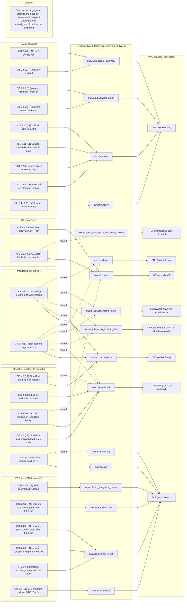

# CIS Controls to Resource Types and AWS Services (Issue 5, control numbers and titles from CIS v7.0.0)

```mermaid
flowchart LR
    subgraph ctl_iam ["IAM (9 controls)"]
        c2_4["CIS 2.4 (L1) No root access key"]
        c2_5["CIS 2.5 (L1) Root MFA enabled"]
        c2_8["CIS 2.8 (L1) Password minimum length 14"]
        c2_9["CIS 2.9 (L1) Password reuse prevented"]
        c2_10["CIS 2.10 (L1) MFA for console users"]
        c2_11["CIS 2.11 (L1) Unused credentials disabled 45 days"]
        c2_12["CIS 2.12 (L1) Access keys rotated 90 days"]
        c2_13["CIS 2.13 (L1) Permissions only through groups"]
        c2_14["CIS 2.14 (L1) No full admin policy attached"]
    end

    subgraph ctl_s3 ["S3 (2 controls)"]
        c3_1_1["CIS 3.1.1 (L2) Bucket policy denies HTTP"]
        c3_1_4["CIS 3.1.4 (L1) S3 Block Public Access enabled"]
    end

    subgraph ctl_ct ["CloudTrail and logs (5 controls)"]
        c4_1["CIS 4.1 (L1) CloudTrail enabled in all regions"]
        c4_2["CIS 4.2 (L2) Log file validation enabled"]
        c4_4["CIS 4.4 (L1) Access logging on CloudTrail bucket"]
        c4_5["CIS 4.5 (L2) CloudTrail logs encrypted with KMS CMK"]
        c4_7["CIS 4.7 (L2) VPC flow logging in all VPCs"]
    end

    subgraph ctl_mon ["Monitoring (2 controls)"]
        c5_2["CIS 5.2 (L1) Console sign-in without MFA monitored"]
        c5_3["CIS 5.3 (L1) Root account usage monitored"]
    end

    subgraph ctl_ec2 ["EC2 and VPC (6 controls)"]
        c6_1_1["CIS 6.1.1 (L1) EBS encryption by default"]
        c6_2["CIS 6.2 (L1) No network ACL admin ports from 0.0.0.0/0"]
        c6_3["CIS 6.3 (L1) No security group admin ports from 0.0.0.0/0"]
        c6_4["CIS 6.4 (L1) No security group admin ports from ::/0"]
        c6_5["CIS 6.5 (L2) Default security group restricts all traffic"]
        c6_7["CIS 6.7 (L1) EC2 metadata allows IMDSv2 only"]
    end

    subgraph typ ["Resource types (target_type and related_types)"]
        t_acct["aws.account.account"]
        t_iam_sum["aws.iam.account_summary"]
        t_iam_pwd["aws.iam.password_policy"]
        t_iam_user["aws.iam.user"]
        t_iam_policy["aws.iam.policy"]
        t_s3_bucket["aws.s3.bucket"]
        t_s3c_pab["aws.s3control.account_public_access_block"]
        t_ct_trail["aws.cloudtrail.trail"]
        t_logs_mf["aws.cloudwatchlogs.metric_filter"]
        t_cw_alarm["aws.cloudwatch.metric_alarm"]
        t_sns_topic["aws.sns.topic"]
        t_ec2_sg["aws.ec2.security_group"]
        t_ec2_nacl["aws.ec2.network_acl"]
        t_ec2_inst["aws.ec2.instance"]
        t_ec2_vpc["aws.ec2.vpc"]
        t_ec2_flow["aws.ec2.flow_log"]
        t_ec2_ebs["aws.ec2.ebs_encryption_default"]
    end

    subgraph svc ["AWS services (SDK crate)"]
        s_sts["STS (aws-sdk-sts)"]
        s_iam["IAM (aws-sdk-iam)"]
        s_s3["S3 (aws-sdk-s3)"]
        s_s3c["S3 Control (aws-sdk-s3control)"]
        s_ct["CloudTrail (aws-sdk-cloudtrail)"]
        s_logs["CloudWatch Logs (aws-sdk-cloudwatchlogs)"]
        s_cw["CloudWatch (aws-sdk-cloudwatch)"]
        s_sns["SNS (aws-sdk-sns)"]
        s_ec2["EC2 (aws-sdk-ec2)"]
    end

    subgraph lgd ["Legend"]
        lgd_note["Solid arrow: target_type (results are made per resource of this type) / Dashed arrow: related_types (used for the judgment)"]
    end

    %% IAM controls
    c2_4 --> t_iam_sum
    c2_5 --> t_iam_sum
    c2_8 --> t_iam_pwd
    c2_9 --> t_iam_pwd
    c2_10 --> t_iam_user
    c2_11 --> t_iam_user
    c2_12 --> t_iam_user
    c2_13 --> t_iam_user
    c2_14 --> t_iam_policy

    %% S3 controls
    c3_1_1 --> t_s3_bucket
    c3_1_4 --> t_s3_bucket
    c3_1_4 -.->|related| t_s3c_pab

    %% CloudTrail and logs controls
    c4_1 --> t_acct
    c4_1 -.->|related| t_ct_trail
    c4_2 --> t_ct_trail
    c4_4 --> t_ct_trail
    c4_4 -.->|related| t_s3_bucket
    c4_5 --> t_ct_trail
    c4_7 --> t_ec2_vpc
    c4_7 -.->|related| t_ec2_flow

    %% Monitoring controls
    c5_2 --> t_acct
    c5_2 -.->|related| t_ct_trail
    c5_2 -.->|related| t_logs_mf
    c5_2 -.->|related| t_cw_alarm
    c5_2 -.->|related| t_sns_topic
    c5_3 --> t_acct
    c5_3 -.->|related| t_ct_trail
    c5_3 -.->|related| t_logs_mf
    c5_3 -.->|related| t_cw_alarm
    c5_3 -.->|related| t_sns_topic

    %% EC2 and VPC controls
    c6_1_1 --> t_ec2_ebs
    c6_2 --> t_ec2_nacl
    c6_3 --> t_ec2_sg
    c6_4 --> t_ec2_sg
    c6_5 --> t_ec2_sg
    c6_7 --> t_ec2_inst

    %% Resource types to AWS services
    t_acct --> s_sts
    t_iam_sum --> s_iam
    t_iam_pwd --> s_iam
    t_iam_user --> s_iam
    t_iam_policy --> s_iam
    t_s3_bucket --> s_s3
    t_s3c_pab --> s_s3c
    t_ct_trail --> s_ct
    t_logs_mf --> s_logs
    t_cw_alarm --> s_cw
    t_sns_topic --> s_sns
    t_ec2_sg --> s_ec2
    t_ec2_nacl --> s_ec2
    t_ec2_inst --> s_ec2
    t_ec2_vpc --> s_ec2
    t_ec2_flow --> s_ec2
    t_ec2_ebs --> s_ec2
```
