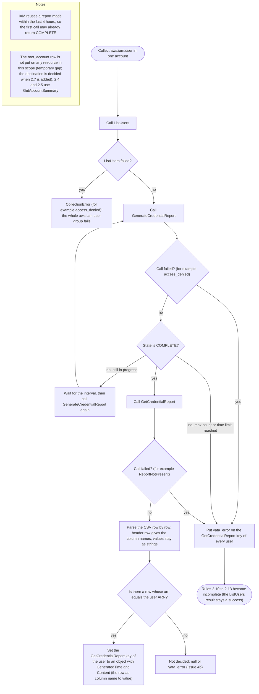

# Credential Report Collection Flow (Issue 5)

```mermaid
flowchart TD
    start(["Collect aws.iam.user in one account"]) --> lu["Call ListUsers"]
    lu --> luf{"ListUsers failed?"}
    luf -->|yes| ce["CollectionError (for example access_denied): the whole aws.iam.user group fails"]
    luf -->|no| gen["Call GenerateCredentialReport"]
    gen --> genf{"Call failed? (for example access_denied)"}
    genf -->|yes| mark["Put yata_error on the GetCredentialReport key of every user"]
    genf -->|no| st{"State is COMPLETE?"}
    st -->|no, still in progress| wait["Wait for the interval, then call GenerateCredentialReport again"]
    wait --> gen
    st -->|no, max count or time limit reached| mark
    st -->|yes| get["Call GetCredentialReport"]
    get --> getf{"Call failed? (for example ReportNotPresent)"}
    getf -->|yes| mark
    getf -->|no| parse["Parse the CSV row by row: header row gives the column names, values stay as strings"]
    parse --> match{"Is there a row whose arn equals the user ARN?"}
    match -->|yes| ok["Set the GetCredentialReport key of the user to an object with GeneratedTime and Content (the row as column name to value)"]
    match -->|no| undecided["Not decided: null or yata_error (Issue 4b)"]
    mark --> inc(["Rules 2.10 to 2.13 become incomplete (the ListUsers result stays a success)"])

    subgraph notes ["Notes"]
        n_reuse["IAM reuses a report made within the last 4 hours, so the first call may already return COMPLETE"]
        n_root["The root_account row is not put on any resource in this scope (temporary gap; the destination is decided when 2.7 is added). 2.4 and 2.5 use GetAccountSummary"]
    end
```
