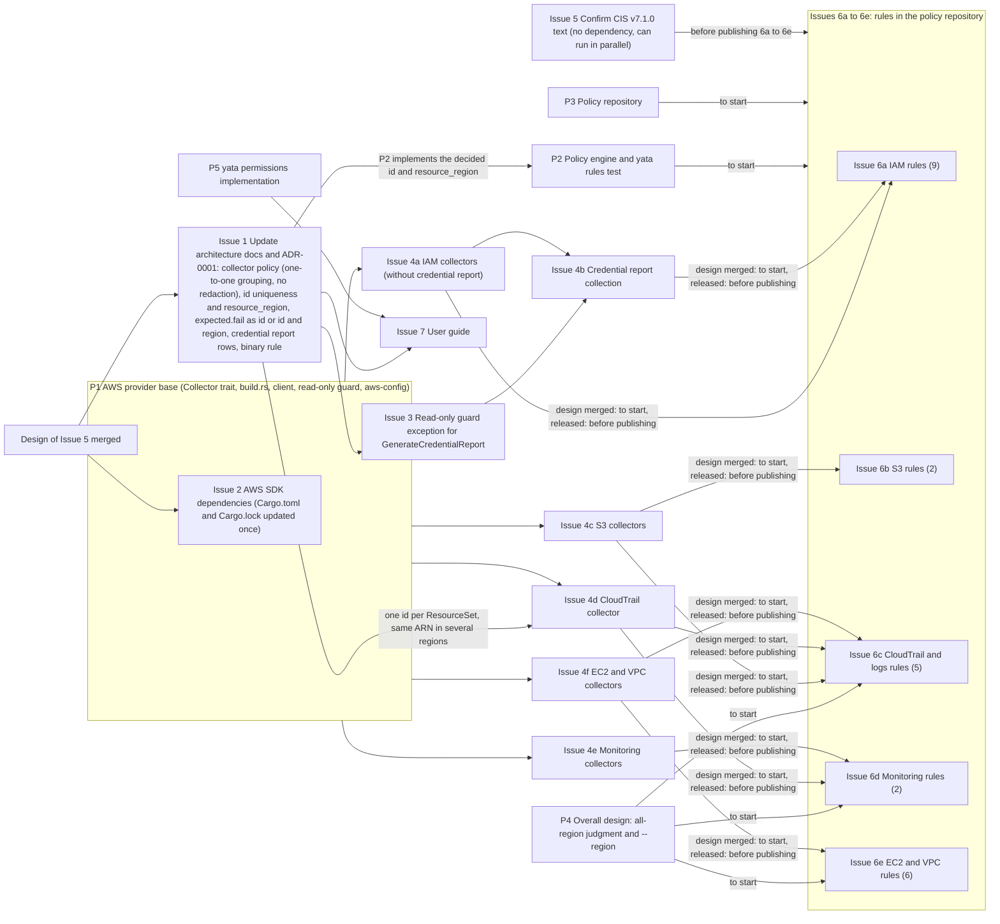

# Dependencies of Follow-up Issues after Issue 5

```mermaid
flowchart LR
    d["Design of Issue 5 merged"]

    subgraph P1 ["P1 AWS provider base (Collector trait, build.rs, client, read-only guard, aws-config)"]
        i2["Issue 2 AWS SDK dependencies (Cargo.toml and Cargo.lock updated once)"]
    end

    i1["Issue 1 Update architecture docs and ADR-0001: collector policy (one-to-one grouping, no redaction), id uniqueness and resource_region, expected.fail as id or id and region, credential report rows, binary rule"]
    i3["Issue 3 Read-only guard exception for GenerateCredentialReport"]
    i4a["Issue 4a IAM collectors (without credential report)"]
    i4b["Issue 4b Credential report collection"]
    i4c["Issue 4c S3 collectors"]
    i4d["Issue 4d CloudTrail collector"]
    i4e["Issue 4e Monitoring collectors"]
    i4f["Issue 4f EC2 and VPC collectors"]
    i5["Issue 5 Confirm CIS v7.1.0 text (no dependency, can run in parallel)"]
    i7["Issue 7 User guide"]

    P2["P2 Policy engine and yata rules test"]
    P3["P3 Policy repository"]
    P4["P4 Overall design: all-region judgment and --region"]
    P5["P5 yata permissions implementation"]

    subgraph RULES ["Issues 6a to 6e: rules in the policy repository"]
        i6a["Issue 6a IAM rules (9)"]
        i6b["Issue 6b S3 rules (2)"]
        i6c["Issue 6c CloudTrail and logs rules (5)"]
        i6d["Issue 6d Monitoring rules (2)"]
        i6e["Issue 6e EC2 and VPC rules (6)"]
    end

    d --> i1
    d --> i2
    i1 --> i3
    i1 -->|"P2 implements the decided id and resource_region"| P2
    i1 -->|"one id per ResourceSet, same ARN in several regions"| i4d
    P1 --> i3
    P1 --> i4a
    P1 --> i4c
    P1 --> i4d
    P1 --> i4e
    P1 --> i4f
    i3 --> i4b
    i4a --> i4b
    P2 -->|"to start"| RULES
    P3 -->|"to start"| RULES
    i5 -->|"before publishing 6a to 6e"| RULES
    P4 -->|"to start"| i6c
    P4 -->|"to start"| i6d
    P4 -->|"to start"| i6e
    i4a -->|"design merged: to start, released: before publishing"| i6a
    i4b -->|"design merged: to start, released: before publishing"| i6a
    i4c -->|"design merged: to start, released: before publishing"| i6b
    i4c -->|"design merged: to start, released: before publishing"| i6c
    i4d -->|"design merged: to start, released: before publishing"| i6c
    i4f -->|"design merged: to start, released: before publishing"| i6c
    i4d -->|"design merged: to start, released: before publishing"| i6d
    i4e -->|"design merged: to start, released: before publishing"| i6d
    i4f -->|"design merged: to start, released: before publishing"| i6e
    i1 --> i7
    P5 --> i7
```
