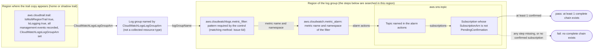

# Monitoring Control Chain for 5.2 and 5.3 (Issue 5)

```mermaid
flowchart LR
    subgraph home ["Region where the trail copy appears (home or shadow trail)"]
        trail["aws.cloudtrail.trail: IsMultiRegionTrail true, IsLogging true, all management events recorded, CloudWatchLogsLogGroupArn set"]
    end

    lg["Log group named by CloudWatchLogsLogGroupArn (not a collected resource type)"]

    subgraph lgreg ["Region of the log group (the steps below are searched in this region)"]
        mf["aws.cloudwatchlogs.metric_filter: pattern required by the control (matching method: Issue 6d)"]
        al["aws.cloudwatch.metric_alarm: metric name and namespace of the filter"]
        subgraph topic ["aws.sns.topic"]
            tp["Topic named in the alarm actions"]
            sub["Subscription whose SubscriptionArn is not PendingConfirmation"]
        end
    end

    pass(["pass: at least 1 complete chain exists"])
    fail(["fail: no complete chain exists"])

    trail -->|"CloudWatchLogsLogGroupArn"| lg
    lg -->|"logGroupName"| mf
    mf -->|"metric name and namespace"| al
    al -->|"alarm actions"| tp
    tp -->|"subscriptions"| sub
    sub -->|"at least 1 confirmed"| pass
    sub -.->|"any step missing, or no confirmed subscription"| fail
```
