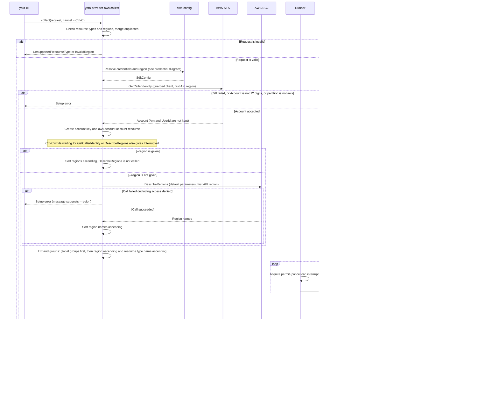

# Collection Sequence (Issue 7)

```mermaid
sequenceDiagram
    participant CLI as yata-cli
    participant P as yata-provider-aws collect
    participant AC as aws-config
    participant STS as AWS STS
    participant EC2 as AWS EC2
    participant R as Runner
    participant C as Collector task
    participant SVC as AWS read APIs

    CLI->>P: collect(request, cancel = Ctrl-C)
    P->>P: Check resource types and regions, merge duplicates
    alt Request is invalid
        P-->>CLI: UnsupportedResourceType or InvalidRegion
    else Request is valid
        P->>AC: Resolve credentials and region (see credential diagram)
        AC-->>P: SdkConfig
        P->>STS: GetCallerIdentity (guarded client, first API region)
        alt Call failed, or Account is not 12 digits, or partition is not aws
            P-->>CLI: Setup error
        else Account accepted
            STS-->>P: Account (Arn and UserId are not kept)
            P->>P: Create account key and aws.account.account resource
            Note over P: Ctrl-C while waiting for GetCallerIdentity or DescribeRegions also gives Interrupted
            alt --region is given
                P->>P: Sort regions ascending, DescribeRegions is not called
            else --region is not given
                P->>EC2: DescribeRegions (default parameters, first API region)
                alt Call failed (including access denied)
                    P-->>CLI: Setup error (message suggests --region)
                else Call succeeded
                    EC2-->>P: Region names
                    P->>P: Sort region names ascending
                end
            end
            P->>P: Expand groups: global groups first, then region ascending and resource type name ascending
            loop Each group in that order
                R->>R: Acquire permit (cancel can interrupt the wait)
                R->>C: Spawn task that holds the permit
            end
            Note over C,SVC: Each task runs its collector, which calls APIs in order through guarded clients
            C->>SVC: Read-only API calls (guarded)
            SVC-->>C: Responses or error
            C-->>R: Group result (recorded as ResourceSet or CollectionError, see result diagram)
            alt Cancel completes before all groups finish
                R->>C: Abort all tasks (JoinSet)
                P-->>CLI: Interrupted (CLI exits with 130 and prints no result)
            else All groups finished
                R->>R: Assemble Inventory
                P-->>CLI: Inventory
            end
        end
    end
```
