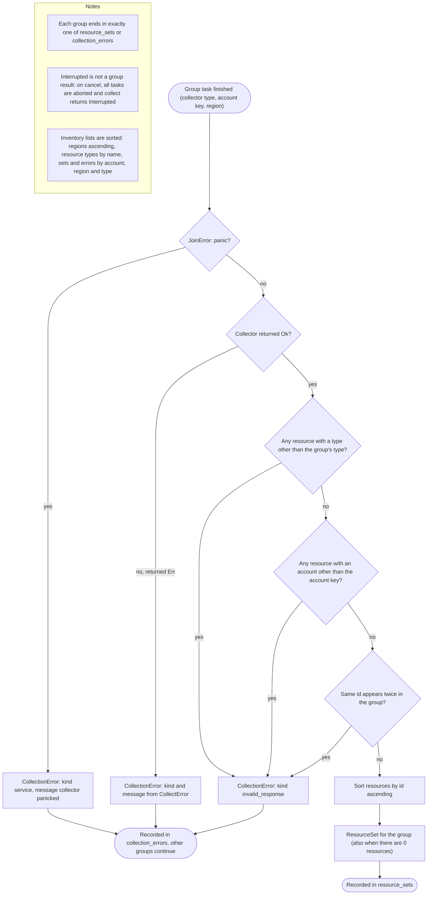

# Group Result Routing (Issue 7)

```mermaid
flowchart TD
    start(["Group task finished (collector type, account key, region)"]) --> j{"JoinError: panic?"}
    j -->|yes| pan["CollectionError: kind service, message collector panicked"]
    j -->|no| r{"Collector returned Ok?"}
    r -->|no, returned Err| ce["CollectionError: kind and message from CollectError"]
    r -->|yes| t{"Any resource with a type other than the group's type?"}
    t -->|yes| bad["CollectionError: kind invalid_response"]
    t -->|no| a{"Any resource with an account other than the account key?"}
    a -->|yes| bad
    a -->|no| d{"Same id appears twice in the group?"}
    d -->|yes| bad
    d -->|no| sort["Sort resources by id ascending"]
    sort --> rs["ResourceSet for the group (also when there are 0 resources)"]
    pan --> errs(["Recorded in collection_errors, other groups continue"])
    ce --> errs
    bad --> errs
    rs --> sets(["Recorded in resource_sets"])

    subgraph notes ["Notes"]
        n_one["Each group ends in exactly one of resource_sets or collection_errors"]
        n_cancel["Interrupted is not a group result: on cancel, all tasks are aborted and collect returns Interrupted"]
        n_order["Inventory lists are sorted: regions ascending, resource types by name, sets and errors by account, region and type"]
    end
```
