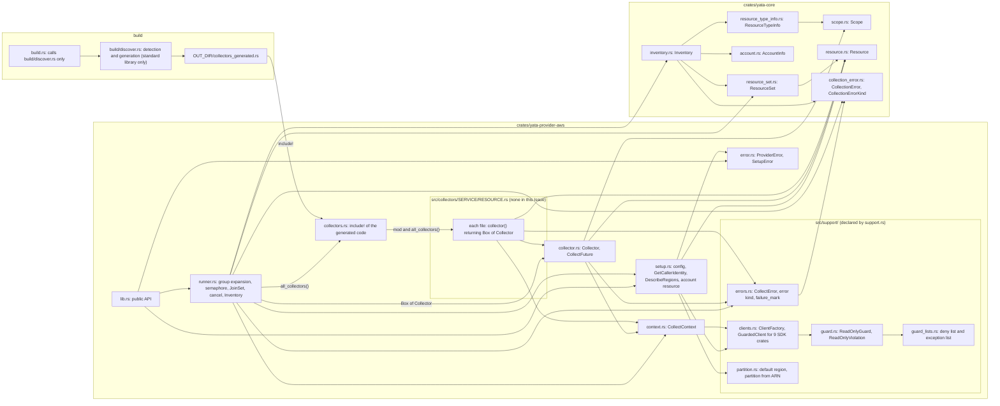

# Provider Module Structure (Issue 7)

```mermaid
flowchart LR
    subgraph provider ["crates/yata-provider-aws"]
        lib["lib.rs: public API"]
        setup["setup.rs: config, GetCallerIdentity, DescribeRegions, account resource"]
        runner["runner.rs: group expansion, semaphore, JoinSet, cancel, Inventory"]
        perr["error.rs: ProviderError, SetupError"]
        collector["collector.rs: Collector, CollectFuture"]
        collectors_rs["collectors.rs: include! of the generated code"]
        ctx["context.rs: CollectContext"]
        subgraph support ["src/support/ (declared by support.rs)"]
            clients["clients.rs: ClientFactory, GuardedClient for 9 SDK crates"]
            guard["guard.rs: ReadOnlyGuard, ReadOnlyViolation"]
            lists["guard_lists.rs: deny list and exception list"]
            errors["errors.rs: CollectError, error kind, failure_mark"]
            partition["partition.rs: default region, partition from ARN"]
        end
        subgraph impls ["src/collectors/SERVICE/RESOURCE.rs (none in this Issue)"]
            impl["each file: collector() returning Box of Collector"]
        end
    end

    subgraph build ["build"]
        buildrs["build.rs: calls build/discover.rs only"]
        discover["build/discover.rs: detection and generation (standard library only)"]
        gen["OUT_DIR/collectors_generated.rs"]
    end

    subgraph core ["crates/yata-core"]
        scope["scope.rs: Scope"]
        resource["resource.rs: Resource"]
        rs["resource_set.rs: ResourceSet"]
        acc["account.rs: AccountInfo"]
        rti["resource_type_info.rs: ResourceTypeInfo"]
        ce["collection_error.rs: CollectionError, CollectionErrorKind"]
        inv["inventory.rs: Inventory"]
    end

    lib --> setup
    lib --> runner
    lib --> perr
    setup --> clients
    setup --> partition
    setup --> resource
    setup --> perr
    runner --> setup
    runner -->|"all_collectors()"| collectors_rs
    runner -->|"Box of Collector"| collector
    runner --> ctx
    runner --> errors
    runner --> inv
    runner --> rs
    runner --> ce
    ctx --> clients
    clients --> guard
    guard --> lists
    collector --> ctx
    collector --> scope
    collector --> resource
    collector --> errors
    impl --> collector
    impl --> ctx
    impl --> errors
    impl --> resource
    buildrs --> discover
    discover --> gen
    gen -->|"include!"| collectors_rs
    collectors_rs -->|"mod and all_collectors()"| impl
    errors --> ce
    inv --> rs
    inv --> acc
    inv --> rti
    inv --> ce
    rs --> resource
    rti --> scope
```
