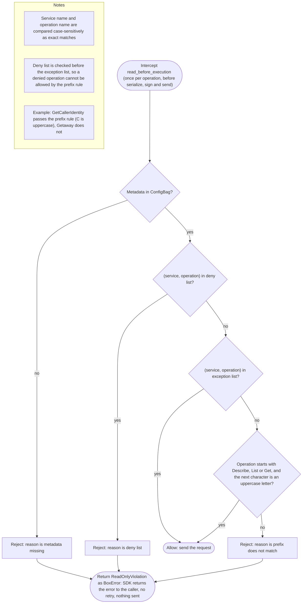

# Read-Only Guard Decision (Issue 7)

```mermaid
flowchart TD
    start(["Intercept read_before_execution (once per operation, before serialize, sign and send)"]) --> meta{"Metadata in ConfigBag?"}
    meta -->|no| rm["Reject: reason is metadata missing"]
    meta -->|yes| deny{"(service, operation) in deny list?"}
    deny -->|yes| rd["Reject: reason is deny list"]
    deny -->|no| exc{"(service, operation) in exception list?"}
    exc -->|yes| allow(["Allow: send the request"])
    exc -->|no| pre{"Operation starts with Describe, List or Get, and the next character is an uppercase letter?"}
    pre -->|yes| allow
    pre -->|no| rp["Reject: reason is prefix does not match"]
    rm --> err(["Return ReadOnlyViolation as BoxError: SDK returns the error to the caller, no retry, nothing sent"])
    rd --> err
    rp --> err

    subgraph notes ["Notes"]
        n_case["Service name and operation name are compared case-sensitively as exact matches"]
        n_order["Deny list is checked before the exception list, so a denied operation cannot be allowed by the prefix rule"]
        n_example["Example: GetCallerIdentity passes the prefix rule (C is uppercase), Getaway does not"]
    end
```
