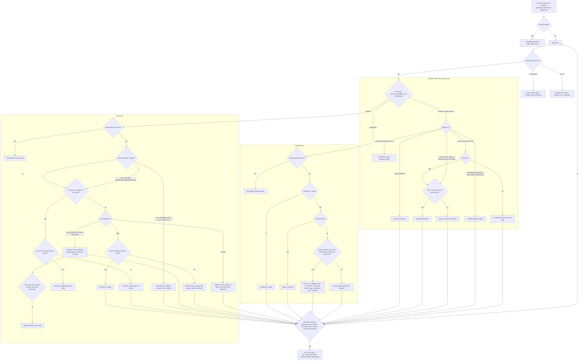

# Directory Walk Classification

```mermaid
flowchart TD
    rd["Read the entries of a directory<br/>(sorted by name bytes, depth-first)"] --> rdf{"read_dir failed?"}
    rdf -->|yes| ur["unreadable (directory-wide). Walk stops"]
    rdf -->|no| entry["Next entry"]

    entry --> utf{"Name is valid UTF-8?"}
    utf -->|no, directory| utfd["Each .rego inside it: invalid_name (rule-level)"]
    utf -->|no, file| utff["Ignored (cannot tell whether it is a .rego file)"]
    utf -->|yes| typ{"Entry type (symlink_metadata, links not followed)"}

    subgraph links["Symbolic links and reparse points"]
        typ -->|"symlink or reparse point"| where{"Where is it?"}
        where -->|"yata-policies.json at the root"| l0["manifest_missing (directory-wide)"]
        where -->|".rego outside lib/"| l1["symlink (rule-level)"]
        where -->|"a .fixtures directory itself"| fxm{"rules test?"}
        fxm -->|no| l6["Not failed (contents are not read)"]
        fxm -->|yes| l2{"Rule .rego of the same name exists?"}
        where -->|"item inside a .fixtures directory (rules test only)"| l2
        l2 -->|yes| l3["symlink (rule-level)"]
        l2 -->|no| l4["orphan_fixtures (rule-level)"]
        where -->|"anything else (directory, item under lib/, other file)"| l5["symlink (directory-wide)"]
    end

    subgraph dirs["Directories"]
        typ -->|directory| dn{"Name starts with a dot?"}
        dn -->|yes| dskip["Not entered, not counted"]
        dn -->|no| fxd{"Name ends with .fixtures?"}
        fxd -->|"yes, LoadMode::Rules (scan, collect, etc.)"| fxskip["Not entered. Counted. Contents not checked"]
        fxd -->|no| dep{"Directory is at depth 10 (the limit)?"}
        fxd -->|"yes, rules test (LoadMode::RulesWithFixtures)"| dep
        dep -->|yes| depe{"Has any entry (even a dot name)?"}
        depe -->|yes| dx["depth_exceeded (directory-wide)"]
        depe -->|no| dcnt["Counted, not entered. No failure"]
        dep -->|no| kind{"Kind of directory"}
        kind -->|"name ends with .fixtures (rules test)"| fxin["Entered. Items collected and checked by rules test. Counted"]
        kind -->|"root lib/"| libin["Entered. Every .rego is a library. No name rules below lib/"]
        kind -->|other| dnm{"Name matches the name rules?"}
        dnm -->|yes| dok["Entered. Counted"]
        dnm -->|no| dbad["Entered. Each .rego inside: invalid_name (rule-level)"]
        fxin --> fxo{"Rule .rego of the same name in the same directory?"}
        fxo -->|no| fxorph["orphan_fixtures (rule-level)"]
    end

    subgraph files["Regular files"]
        typ -->|"regular file"| rf{"Root yata-policies.json?"}
        rf -->|yes| mskip["Not walked (manifest step)"]
        rf -->|no| ext{"Extension is .rego?"}
        ext -->|no| ign["Ignored. Counted"]
        ext -->|yes| inlib{"Under root lib/?"}
        inlib -->|yes| lib["Library. Counted"]
        inlib -->|no| fnm{"Every directory name and the file name match the name rules?"}
        fnm -->|yes| rule["Rule. ID = manifest name + directories + file name without .rego, joined with dots. Counted"]
        fnm -->|no| rinv["invalid_name (rule-level). Counted"]
    end

    cnt{"Files over 20,000 or directories over 5,000 so far? (links count as files, never as directories)"}
    ign --> cnt
    lib --> cnt
    rule --> cnt
    rinv --> cnt
    dok --> cnt
    dcnt --> cnt
    fxskip --> cnt
    fxin --> cnt
    dbad --> cnt
    libin --> cnt
    l1 --> cnt
    l3 --> cnt
    l4 --> cnt
    l5 --> cnt
    l6 --> cnt
    cnt -->|yes| lim["too_many_files / too_many_directories (directory-wide). Walk stops"]
    cnt -->|no| entry
```
