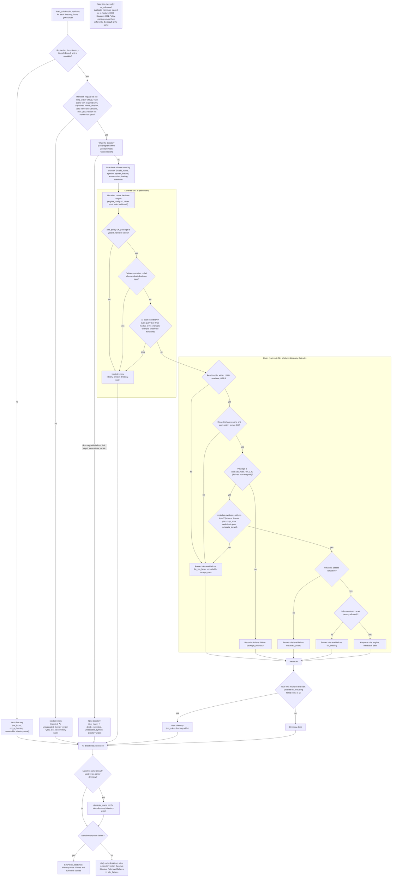

# Load Processing Order

```mermaid
flowchart TD
    start["load_policies(dirs, options)<br/>for each directory, in the given order"] --> root{"Root exists, is a directory (links followed) and is readable?"}
    root -->|no| nd["Next directory<br/>(not_found, not_a_directory, unreadable: directory-wide)"]
    root -->|yes| man{"Manifest: regular file (no link), within 64 KiB, valid JSON with required keys, supported format_version, valid name and versions, min_yata_version not newer than yata?"}
    man -->|no| nd2["Next directory<br/>(manifest_* / unsupported_format_version / yata_too_old: directory-wide)"]
    man -->|yes| walk["Walk the directory<br/>(see Diagram-0008-Directory-Walk-Classification)"]
    walk -->|"directory-wide failure: limit, depth, unreadable, or link"| nd3["Next directory<br/>(too_many_*, depth_exceeded, unreadable, symlink: directory-wide)"]
    walk -->|ok| wnote["Rule-level failures found by the walk (invalid_name, symlink, orphan_fixtures) are recorded; loading continues"]
    wnote --> base["Libraries: create the base engine<br/>(engine_config: v1, timer, print, strict builtins off)"]

    subgraph libs["Libraries (lib/, in path order)"]
        base --> lb1{"add_policy OK, package is yata.lib.name or below?"}
        lb1 -->|no| nd4["Next directory<br/>(library_invalid: directory-wide)"]
        lb1 -->|yes| lb2{"Defines metadata or fail when evaluated with no input?"}
        lb2 -->|yes| nd4
        lb2 -->|no| lb3{"At least one library? eval_query true finds module-level errors (for example undefined functions)"}
        lb3 -->|error| nd4
    end

    lb3 -->|ok| rule1

    subgraph rules["Rules (each rule file; a failure skips only that rule)"]
        rule1{"Read the file: within 1 MiB, readable, UTF-8"} -->|no| rfail["Record rule-level failure: file_too_large, unreadable, or rego_error"]
        rule1 -->|yes| rule2{"Clone the base engine and add_policy: syntax OK?"}
        rule2 -->|no| rfail
        rule2 -->|yes| rule3{"Package is data.yata.rules.RULE_ID (derived from the path)?"}
        rule3 -->|no| rfail2["Record rule-level failure: package_mismatch"]
        rule3 -->|yes| rule4{"metadata evaluates with no input? (error or timeout gives rego_error; undefined gives metadata_invalid)"}
        rule4 -->|no| rfail
        rule4 -->|yes| rule5{"metadata passes validation?"}
        rule5 -->|no| rfail3["Record rule-level failure: metadata_invalid"]
        rule5 -->|yes| rule6{"fail evaluates to a set (empty allowed)?"}
        rule6 -->|no| rfail4["Record rule-level failure: fail_missing"]
        rule6 -->|yes| rkeep["Keep the rule: engine, metadata, path"]
    end

    rfail --> rnext["Next rule"]
    rfail2 --> rnext
    rfail3 --> rnext
    rfail4 --> rnext
    rkeep --> rnext
    rnext --> cnt{"Rule files found by the walk (outside lib/, including failed ones) is 0?"}
    cnt -->|yes| nd5["Next directory<br/>(no_rules: directory-wide)"]
    cnt -->|no| done["Directory done"]

    nd --> alld["All directories processed"]
    nd2 --> alld
    nd3 --> alld
    nd4 --> alld
    nd5 --> alld
    done --> alld

    alld --> dup{"Manifest name already used by an earlier directory?"}
    dup -->|yes| dwdup["duplicate_name on the later directory (directory-wide)"]
    dup -->|no| anyd{"Any directory-wide failure?"}
    dwdup --> anyd
    anyd -->|yes| errr["Err(PolicyLoadError): directory-wide failures and rule-level failures"]
    anyd -->|no| okr["Ok(LoadedPolicies): rules in directory order, then rule ID order. Rule-level failures in rule_failures"]

    note["Note: the checks for no_rules and duplicate_name are placed as in Feature-0008. Diagram-0001-Policy-Loading orders them differently; the result is the same"]
```
