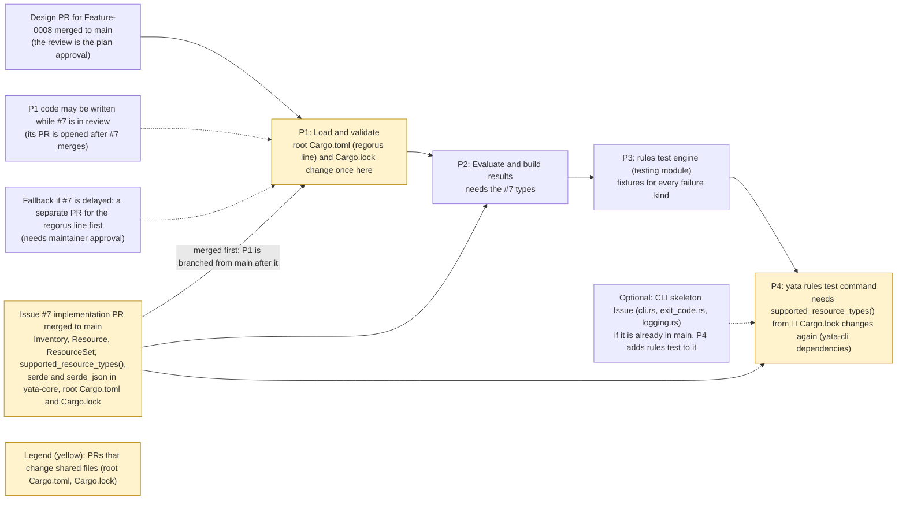

# Milestones and Dependencies (P1 to P4 and Issue 7)

```mermaid
flowchart LR
    design["Design PR for Feature-0008 merged to main<br/>(the review is the plan approval)"]
    i7["Issue #7 implementation PR merged to main<br/>Inventory, Resource, ResourceSet, supported_resource_types(),<br/>serde and serde_json in yata-core, root Cargo.toml and Cargo.lock"]
    p1["P1: Load and validate<br/>root Cargo.toml (regorus line) and Cargo.lock change once here"]
    p2["P2: Evaluate and build results<br/>needs the #7 types"]
    p3["P3: rules test engine (testing module)<br/>fixtures for every failure kind"]
    p4["P4: yata rules test command<br/>needs supported_resource_types() from #7; Cargo.lock changes again (yata-cli dependencies)"]

    design --> p1
    i7 -->|"merged first: P1 is branched from main after it"| p1
    p1 --> p2
    i7 --> p2
    p2 --> p3
    p3 --> p4
    i7 --> p4

    cli["Optional: CLI skeleton Issue (cli.rs, exit_code.rs, logging.rs)<br/>if it is already in main, P4 adds rules test to it"]
    cli -.-> p4

    par["P1 code may be written while #7 is in review<br/>(its PR is opened after #7 merges)"]
    par -.-> p1

    alt["Fallback if #7 is delayed: a separate PR for the regorus line first<br/>(needs maintainer approval)"]
    alt -.-> p1

    legend["Legend (yellow): PRs that change shared files (root Cargo.toml, Cargo.lock)"]

    classDef shared fill:#fff3cd,stroke:#b8860b
    class i7,p1,p4,legend shared
```
