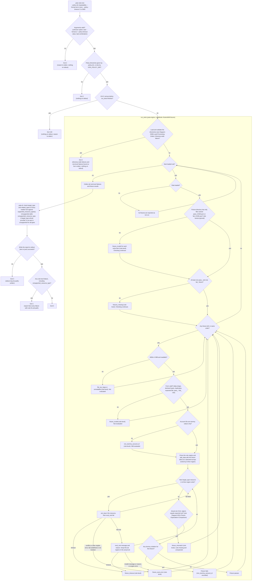

# yata rules test Flow and Exit Codes

```mermaid
flowchart TD
    cmd["yata rules test<br/>--policy-dir (repeatable), --format text or json, --policy-timeout 1 to 3600"] --> args{"Arguments valid? (unknown option, bad --format or --policy-timeout value, bad combination)"}
    args -->|no| e2a["Exit 2<br/>(reason to stderr, nothing on stdout)"]
    args -->|yes| dirs{"Policy directories given by --policy-dir, or else by YATA_POLICY_DIR?"}
    dirs -->|no| e2b["Exit 2<br/>(nothing on stdout)"]
    dirs -->|yes| race{"Ctrl-C arrives before run_tests finishes?"}
    race -->|yes| e130["Exit 130<br/>(nothing on stdout, reason to stderr)"]
    race -->|no| load

    subgraph engine["run_tests (yata-engine, LoadMode::RulesWithFixtures)"]
        load{"Load and validate the directories (see Diagram-0008-Load-Processing-Order). Directory-wide failure?"} -->|yes| e2c["Exit 2<br/>(directory-wide failures and rule-level failures found so far to stderr, nothing on stdout)"]
        load -->|no| each{"Next loaded rule?"}
        each -->|no| coll["Collect all rule-level failures and fixture results"]
        each -->|yes| ld{"Rule loaded?"}
        ld -->|no| nr["Its fixtures are reported as not run"]
        nr --> each
        ld -->|yes| fdir{"Fixture directory has only files named pass_CASE.json or fail_CASE.json? (dot names ignored)"}
        fdir -->|no| fi1["fixture_invalid for each extra item (rule-level). Checking continues"]
        fdir -->|yes| pf{"At least one pass_ and one fail_ fixture?"}
        fi1 --> pf
        pf -->|no| fm["fixtures_missing (rule-level). Checking continues"]
        pf -->|yes| fx{"Any fixture left, in name order?"}
        fm --> fx
        fx -->|no| each
        fx -->|yes| rd{"Within 4 MiB and readable?"}
        rd -->|no| fr["file_too_large or unreadable (rule-level). Not evaluated"]
        rd -->|yes| form{"Form valid? (data shape, declared types, duplicates, expected.fail, pass_ / fail_ rule)"}
        form -->|no| ffi["fixture_invalid (rule-level). Not evaluated"]
        form -->|yes| dummy{"Account IDs are dummy values only?"}
        dummy -->|no| nd["non_dummy_account_id (rule-level). Still evaluated"]
        dummy -->|yes| ev0
        nd --> ev0
        ev0["Clone the rule engine and add_data with the fixture data as is (declared arrays sorted by id then region)"] --> evn{"Next target_type resource in id then region order?"}
        evn -->|yes| evi["set_input: this resource, then eval_rule fail"]
        evi -->|timeout| to["fixture_timeout (rule-level)"]
        evi -->|conflict or other engine error, fail undefined or not boolean| ee["fixture_eval_error (rule-level)"]
        evi -->|fail false| evn
        evi -->|fail true| evm["eval_rule message and reason. Keep this (id, region) in the actual set"]
        evm -->|timeout| to
        evm -->|invalid message or reason, or engine error| ee
        evm -->|ok| evn
        evn -->|no| mm0{"Actual set of (id, region) equals expected set? (see Diagram-0011-Fixture-Expectation-Comparison)"}
        mm0 -->|no| mm["fixture_mismatch (rule-level). Lists missing and unexpected"]
        mm0 -->|yes| eqd{"Any dummy violation for this fixture?"}
        eqd -->|yes| ndf["Fixture fails (non_dummy_account_id recorded)"]
        eqd -->|no| pass["Fixture passes"]
        fr --> fx
        ffi --> fx
        to --> fx
        ee --> fx
        mm --> fx
        ndf --> fx
        pass --> fx
    end

    coll --> prov["yata-cli: check target_type and related_types of every loaded rule against supported_resource_types(). Unsupported adds unsupported_resource_type. A target_type whose provider is not aws is unsupported for all types"]
    prov --> out{"Write the report to stdout (text or json) succeeds?"}
    out -->|no| e3["Exit 3<br/>(stdout may be partly written)"]
    out -->|yes| anyf{"Any rule-level failure, including unsupported_resource_type?"}
    anyf -->|yes| e1["Exit 1<br/>(report lists every failure with rule ID and path)"]
    anyf -->|no| e0["Exit 0"]
```
