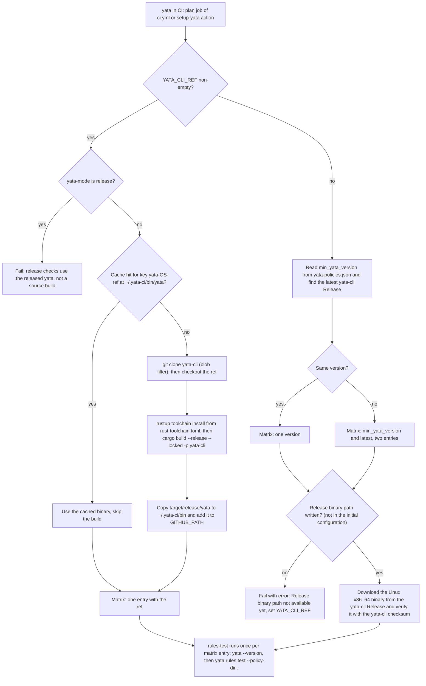

# CI yata Selection

```mermaid
flowchart TD
    start["yata in CI: plan job of ci.yml or setup-yata action"] --> ref{"YATA_CLI_REF non-empty?"}

    ref -->|yes| mode{"yata-mode is release?"}
    mode -->|yes| fail1["Fail: release checks use the released yata, not a source build"]
    mode -->|no| cache{"Cache hit for key yata-OS-ref at ~/.yata-ci/bin/yata?"}
    cache -->|yes| useCache["Use the cached binary, skip the build"]
    cache -->|no| clone["git clone yata-cli (blob filter), then checkout the ref"]
    clone --> build["rustup toolchain install from rust-toolchain.toml, then cargo build --release --locked -p yata-cli"]
    build --> put["Copy target/release/yata to ~/.yata-ci/bin and add it to GITHUB_PATH"]
    useCache --> srcMatrix["Matrix: one entry with the ref"]
    put --> srcMatrix

    ref -->|no| versions["Read min_yata_version from yata-policies.json and find the latest yata-cli Release"]
    versions --> same{"Same version?"}
    same -->|yes| one["Matrix: one version"]
    same -->|no| two["Matrix: min_yata_version and latest, two entries"]
    one --> impl{"Release binary path written? (not in the initial configuration)"}
    two --> impl
    impl -->|no| fail2["Fail with error: Release binary path not available yet, set YATA_CLI_REF"]
    impl -->|yes| dl["Download the Linux x86_64 binary from the yata-cli Release and verify it with the yata-cli checksum"]

    srcMatrix --> rt["rules-test runs once per matrix entry: yata --version, then yata rules test --policy-dir ."]
    dl --> rt
```
