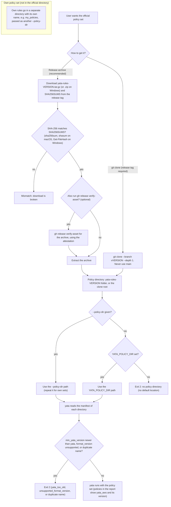

# Policy Acquisition and Selection for Users

```mermaid
flowchart TD
    start["User wants the official policy set"] --> how{"How to get it?"}

    how -->|"Release archive (recommended)"| dl["Download yata-rules-VERSION.tar.gz (or .zip on Windows) and SHA256SUMS from the release tag"]
    dl --> hash{"SHA-256 matches SHA256SUMS? (sha256sum, shasum on macOS, Get-FileHash on Windows)"}
    hash -->|no| bad["Mismatch: download is broken"]
    hash -->|yes| optv{"Also run gh release verify-asset? (optional)"}
    optv -->|yes| verify["gh release verify-asset for the archive, using the attestation"]
    optv -->|no| ext["Extract the archive"]
    verify --> ext

    how -->|"git clone (release tag required)"| clone["git clone --branch vVERSION --depth 1. Never use main"]
    clone --> dir

    ext --> dir["Policy directory: yata-rules-VERSION folder, or the clone root"]

    dir --> flag{"--policy-dir given?"}
    flag -->|yes| use1["Use the --policy-dir path (repeat it for own sets)"]
    flag -->|no| env{"YATA_POLICY_DIR set?"}
    env -->|yes| use2["Use the YATA_POLICY_DIR path"]
    env -->|no| exit2a["Exit 2: no policy directory (no default location)"]

    use1 --> check["yata reads the manifest of each directory"]
    use2 --> check
    check --> bad2{"min_yata_version newer than yata, format_version unsupported, or duplicate name?"}
    bad2 -->|yes| exit2b["Exit 2 (yata_too_old, unsupported_format_version, or duplicate name)"]
    bad2 -->|no| run["yata runs with the policy set (policies in the report show yata_aws and its version)"]

    subgraph own["Own policy set (not in the official directory)"]
        ownNote["Own rules go in a separate directory with its own name, e.g. my_policies, passed as another --policy-dir"]
    end
```
