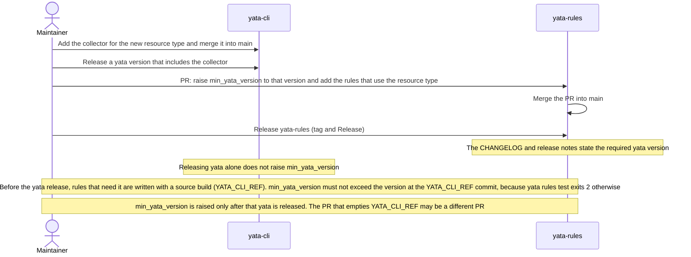

# yata-cli and yata-rules Release Order

```mermaid
sequenceDiagram
    actor M as Maintainer
    participant CLI as yata-cli
    participant RULES as yata-rules

    M->>CLI: Add the collector for the new resource type and merge it into main
    M->>CLI: Release a yata version that includes the collector
    M->>RULES: PR: raise min_yata_version to that version and add the rules that use the resource type
    RULES->>RULES: Merge the PR into main
    M->>RULES: Release yata-rules (tag and Release)
    Note over RULES: The CHANGELOG and release notes state the required yata version
    Note over CLI: Releasing yata alone does not raise min_yata_version
    Note over M,RULES: Before the yata release, rules that need it are written with a source build (YATA_CLI_REF). min_yata_version must not exceed the version at the YATA_CLI_REF commit, because yata rules test exits 2 otherwise
    Note over M,RULES: min_yata_version is raised only after that yata is released. The PR that empties YATA_CLI_REF may be a different PR
```
