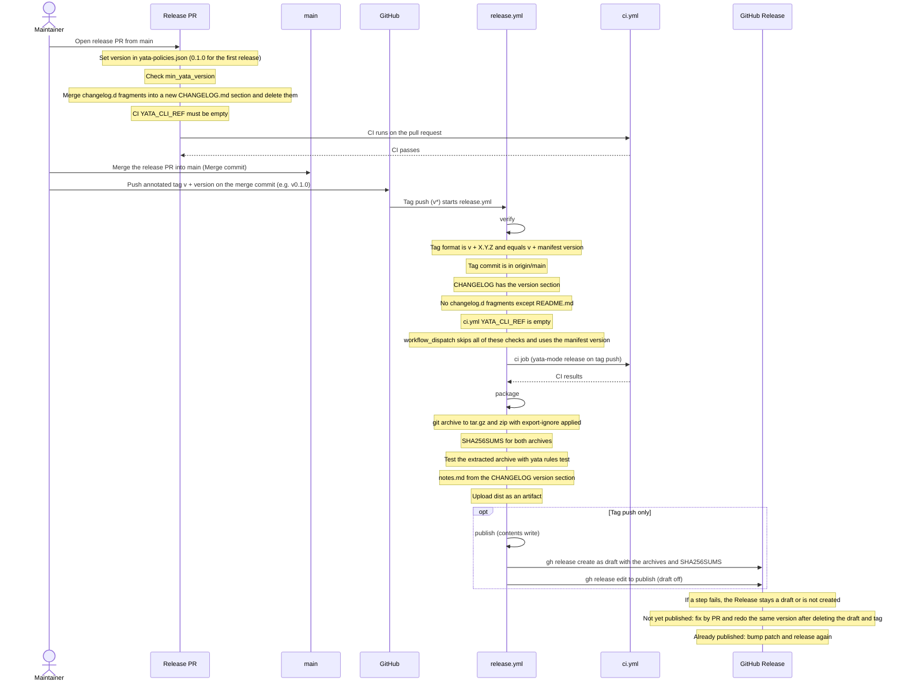

# yata-rules Release Sequence

```mermaid
sequenceDiagram
    actor M as Maintainer
    participant PR as Release PR
    participant Main as main
    participant GH as GitHub
    participant RW as release.yml
    participant CI as ci.yml
    participant Rel as GitHub Release

    M->>PR: Open release PR from main
    Note over PR: Set version in yata-policies.json (0.1.0 for the first release)
    Note over PR: Check min_yata_version
    Note over PR: Merge changelog.d fragments into a new CHANGELOG.md section and delete them
    Note over PR: CI YATA_CLI_REF must be empty
    PR->>CI: CI runs on the pull request
    CI-->>PR: CI passes
    M->>Main: Merge the release PR into main (Merge commit)
    M->>GH: Push annotated tag v + version on the merge commit (e.g. v0.1.0)
    GH->>RW: Tag push (v*) starts release.yml
    RW->>RW: verify
    Note over RW: Tag format is v + X.Y.Z and equals v + manifest version
    Note over RW: Tag commit is in origin/main
    Note over RW: CHANGELOG has the version section
    Note over RW: No changelog.d fragments except README.md
    Note over RW: ci.yml YATA_CLI_REF is empty
    Note over RW: workflow_dispatch skips all of these checks and uses the manifest version
    RW->>CI: ci job (yata-mode release on tag push)
    CI-->>RW: CI results
    RW->>RW: package
    Note over RW: git archive to tar.gz and zip with export-ignore applied
    Note over RW: SHA256SUMS for both archives
    Note over RW: Test the extracted archive with yata rules test
    Note over RW: notes.md from the CHANGELOG version section
    Note over RW: Upload dist as an artifact
    opt Tag push only
        RW->>RW: publish (contents write)
        RW->>Rel: gh release create as draft with the archives and SHA256SUMS
        RW->>Rel: gh release edit to publish (draft off)
    end
    Note over Rel: If a step fails, the Release stays a draft or is not created
    Note over Rel: Not yet published: fix by PR and redo the same version after deleting the draft and tag
    Note over Rel: Already published: bump patch and release again
```
