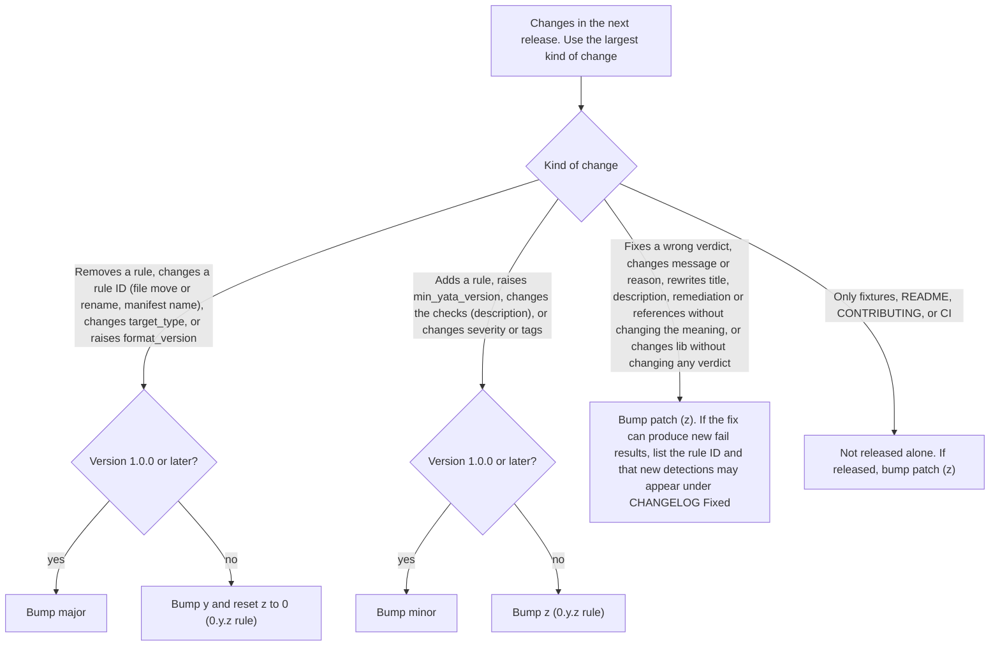

# Policy Set Version Bump Decision

```mermaid
flowchart TD
    start["Changes in the next release. Use the largest kind of change"] --> kind{"Kind of change"}

    kind -->|"Removes a rule, changes a rule ID (file move or rename, manifest name), changes target_type, or raises format_version"| brk{"Version 1.0.0 or later?"}
    kind -->|"Adds a rule, raises min_yata_version, changes the checks (description), or changes severity or tags"| add{"Version 1.0.0 or later?"}
    kind -->|"Fixes a wrong verdict, changes message or reason, rewrites title, description, remediation or references without changing the meaning, or changes lib without changing any verdict"| fix["Bump patch (z). If the fix can produce new fail results, list the rule ID and that new detections may appear under CHANGELOG Fixed"]
    kind -->|"Only fixtures, README, CONTRIBUTING, or CI"| none["Not released alone. If released, bump patch (z)"]

    brk -->|yes| bmajor["Bump major"]
    brk -->|no| by["Bump y and reset z to 0 (0.y.z rule)"]
    add -->|yes| bminor["Bump minor"]
    add -->|no| bz["Bump z (0.y.z rule)"]
```
