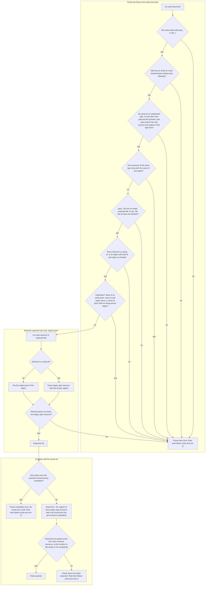

# Fixture Expectations and Comparison

```mermaid
flowchart TD
    subgraph form["Check the fixture form (rules test only)"]
        ff["For each fixture file"] --> g1{"File name starts with pass_ or fail_?"}
        g1 -->|no| ferr["Fixture form error. Rule-level failure (rules test exit 1)"]
        g1 -->|yes| g2{"data has an array for every declared type (empty array allowed)?"}
        g2 -->|no| ferr
        g2 -->|yes| g2b{"No array for an undeclared type, no key other than yata and the provider, and yata.context has only account and regions of the right form?"}
        g2b -->|no| ferr
        g2b -->|yes| g3{"Two resources of the same type array with the same id and region?"}
        g3 -->|yes| ferr
        g3 -->|no| g4{"pass_ file has an empty expected.fail, or fail_ file has at least one element?"}
        g4 -->|no| ferr
        g4 -->|yes| g5{"Every element is a string id, or an object with both id and region as strings?"}
        g5 -->|no| ferr
        g5 -->|yes| g6{"Duplicates? Same id as string twice, same id and region twice, or same id given both as string and as object?"}
        g6 -->|yes| ferr
    end

    subgraph expect["Build the expected set of (id, region) pairs"]
        g6 -->|no| h0["For each element of expected.fail"] --> h1{"Element is a string id?"}
        h1 -->|yes| h2["Every target_type resource with this id (any region)"]
        h1 -->|no| h3["The (id, region) pair of the object"]
        h2 --> h4{"Element points at at least one target_type resource?"}
        h3 --> h4
        h4 -->|no| ferr
        h4 -->|yes| h5["Expected set"]
    end

    subgraph cmp["Compare with the actual set"]
        h5 --> k1{"Rule status error (for example timeout) during evaluation?"}
        k1 -->|yes| kerr["Fixture evaluation error. No actual set is built. Rule-level failure (rules test exit 1)"]
        k1 -->|no| k0["Actual set = (id, region) of every target_type resource with a fail result (from the per-resource evaluation)"]
        k0 --> k2{"Expected set equals actual set? (one result per resource, so the number of fail results is not compared)"}
        k2 -->|yes| kpass["Fixture passes"]
        k2 -->|no| kfail["Fixture does not match expected. Rule-level failure (rules test exit 1)"]
    end
```
