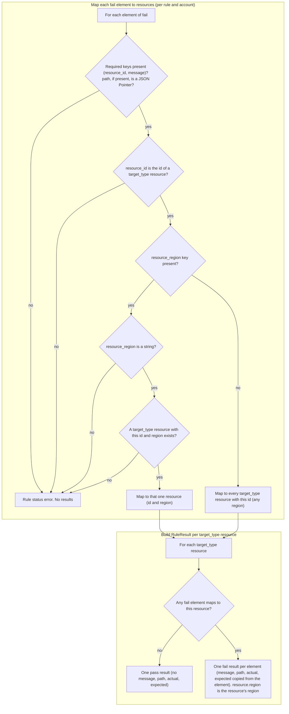
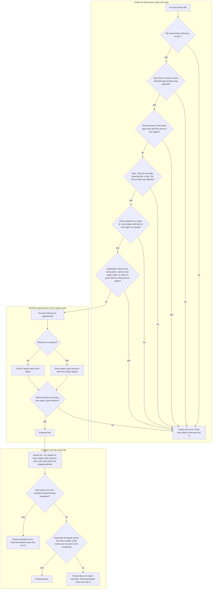

# Result to Resource Mapping and Fixture Expectations

```mermaid
flowchart TD
    subgraph map["Map each fail element to resources (per rule and account)"]
        el["For each element of fail"] --> f1{"Required keys present (resource_id, message)? path, if present, is a JSON Pointer?"}
        f1 -->|no| err["Rule status error. No results"]
        f1 -->|yes| f2{"resource_id is the id of a target_type resource?"}
        f2 -->|no| err
        f2 -->|yes| f3{"resource_region key present?"}
        f3 -->|no| all["Map to every target_type resource with this id (any region)"]
        f3 -->|yes| f4{"resource_region is a string?"}
        f4 -->|no| err
        f4 -->|yes| f5{"A target_type resource with this id and region exists?"}
        f5 -->|no| err
        f5 -->|yes| one["Map to that one resource (id and region)"]
    end

    subgraph res["Build RuleResult per target_type resource"]
        r0["For each target_type resource"] --> r1{"Any fail element maps to this resource?"}
        r1 -->|no| pass["One pass result (no message, path, actual, expected)"]
        r1 -->|yes| fail["One fail result per element (message, path, actual, expected copied from the element). resource.region is the resource's region"]
    end

    one --> r0
    all --> r0
```

```mermaid
flowchart TD
    subgraph form["Check the fixture form (rules test only)"]
        ff["For each fixture file"] --> g1{"File name starts with pass_ or fail_?"}
        g1 -->|no| ferr["Fixture form error. Rule-level failure (rules test exit 1)"]
        g1 -->|yes| g2{"input has an array for every declared type (empty array allowed)?"}
        g2 -->|no| ferr
        g2 -->|yes| g3{"Two resources of the same type array with the same id and region?"}
        g3 -->|yes| ferr
        g3 -->|no| g4{"pass_ file has an empty expected.fail, or fail_ file has at least one element?"}
        g4 -->|no| ferr
        g4 -->|yes| g5{"Every element is a string id, or an object with both id and region as strings?"}
        g5 -->|no| ferr
        g5 -->|yes| g6{"Duplicates? Same id as string twice, same id and region twice, or same id given both as string and as object?"}
        g6 -->|yes| ferr
    end

    subgraph expect["Build the expected set of (id, region) pairs"]
        g6 -->|no| h0["For each element of expected.fail"] --> h1{"Element is a string id?"}
        h1 -->|yes| h2["Every target_type resource with this id (any region)"]
        h1 -->|no| h3["The (id, region) pair of the object"]
        h2 --> h4{"Element points at at least one target_type resource?"}
        h3 --> h4
        h4 -->|no| ferr
        h4 -->|yes| h5["Expected set"]
    end

    subgraph cmp["Compare with the actual set"]
        h5 --> k0["Actual set = (id, region) of every target_type resource with a fail result (from the mapping above)"]
        k0 --> k1{"Rule status error (for example timeout) during evaluation?"}
        k1 -->|yes| kerr["Fixture evaluation error. Rule-level failure (rules test exit 1)"]
        k1 -->|no| k2{"Expected set equals actual set? (the number of fail results per resource is not compared)"}
        k2 -->|yes| kpass["Fixture passes"]
        k2 -->|no| kfail["Fixture does not match expected. Rule-level failure (rules test exit 1)"]
    end
```
