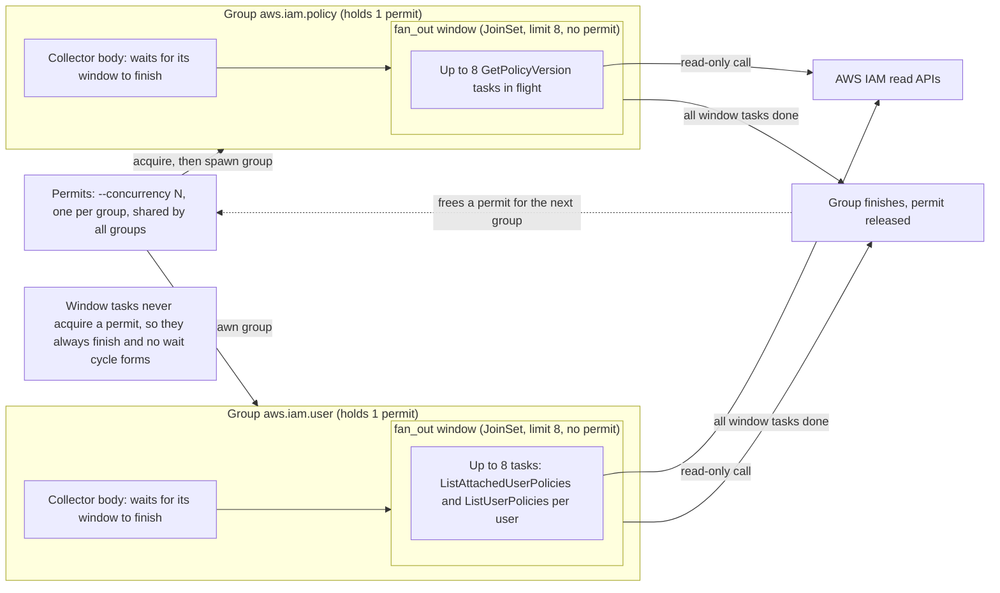

# IAM Concurrency Structure

```mermaid
flowchart LR
    Permits["Permits: --concurrency N, one per group, shared by all groups"]

    subgraph GA["Group aws.iam.policy (holds 1 permit)"]
        CA["Collector body: waits for its window to finish"]
        subgraph WA["fan_out window (JoinSet, limit 8, no permit)"]
            TA["Up to 8 GetPolicyVersion tasks in flight"]
        end
        CA --> WA
    end

    subgraph GB["Group aws.iam.user (holds 1 permit)"]
        CB["Collector body: waits for its window to finish"]
        subgraph WB["fan_out window (JoinSet, limit 8, no permit)"]
            TB["Up to 8 tasks: ListAttachedUserPolicies and ListUserPolicies per user"]
        end
        CB --> WB
    end

    Permits -->|"acquire, then spawn group"| GA
    Permits -->|"acquire, then spawn group"| GB

    TA -->|"read-only call"| API["AWS IAM read APIs"]
    TB -->|"read-only call"| API

    WA -->|"all window tasks done"| Release["Group finishes, permit released"]
    WB -->|"all window tasks done"| Release
    Release -.->|"frees a permit for the next group"| Permits

    NoWait["Window tasks never acquire a permit, so they always finish and no wait cycle forms"]
```
