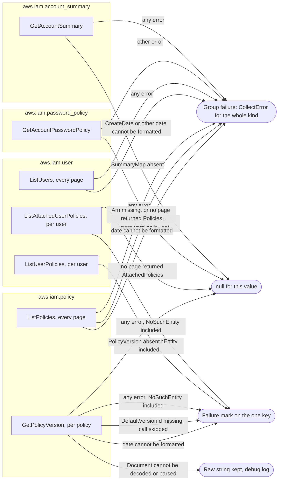

# IAM Error Routing by Operation

```mermaid
flowchart LR
    GF(["Group failure: CollectError for the whole kind"])
    MK(["Failure mark on the one key"])
    NL(["null for this value"])
    RAW(["Raw string kept, debug log"])

    subgraph AS["aws.iam.account_summary"]
        A1["GetAccountSummary"]
    end

    subgraph PP["aws.iam.password_policy"]
        P1["GetAccountPasswordPolicy"]
    end

    subgraph US["aws.iam.user"]
        U1["ListUsers, every page"]
        U2["ListAttachedUserPolicies, per user"]
        U3["ListUserPolicies, per user"]
    end

    subgraph PO["aws.iam.policy"]
        O1["ListPolicies, every page"]
        O2["GetPolicyVersion, per policy"]
    end

    A1 -->|"any error"| GF
    A1 -->|"SummaryMap absent"| NL

    P1 -->|"NoSuchEntity: no password policy set"| NL
    P1 -->|"other error"| GF

    U1 -->|"any error"| GF
    U1 -->|"CreateDate or other date cannot be formatted"| GF

    U2 -->|"any error, NoSuchEntity included"| MK
    U2 -->|"no page returned AttachedPolicies"| NL
    U3 -->|"any error, NoSuchEntity included"| MK

    O1 -->|"any error"| GF
    O1 -->|"Arn missing, or no page returned Policies"| GF
    O1 -->|"date cannot be formatted"| GF

    O2 -->|"any error, NoSuchEntity included"| MK
    O2 -->|"DefaultVersionId missing, call skipped"| MK
    O2 -->|"date cannot be formatted"| MK
    O2 -->|"PolicyVersion absent"| NL
    O2 -->|"Document cannot be decoded or parsed"| RAW
```
