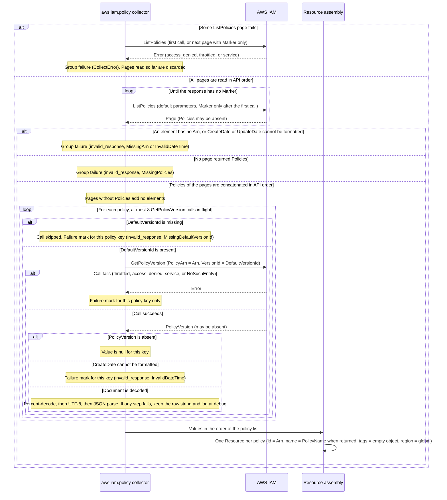

# IAM Policy Collection Sequence

```mermaid
sequenceDiagram
    participant C as aws.iam.policy collector
    participant IAM as AWS IAM
    participant R as Resource assembly

    alt Some ListPolicies page fails
        C->>IAM: ListPolicies (first call, or next page with Marker only)
        IAM-->>C: Error (access_denied, throttled, or service)
        Note over C: Group failure (CollectError). Pages read so far are discarded
    else All pages are read in API order
        loop Until the response has no Marker
            C->>IAM: ListPolicies (default parameters, Marker only after the first call)
            IAM-->>C: Page (Policies may be absent)
        end
        alt An element has no Arn, or CreateDate or UpdateDate cannot be formatted
            Note over C: Group failure (invalid_response, MissingArn or InvalidDateTime)
        else No page returned Policies
            Note over C: Group failure (invalid_response, MissingPolicies)
        else Policies of the pages are concatenated in API order
            Note over C: Pages without Policies add no elements
            loop For each policy, at most 8 GetPolicyVersion calls in flight
                alt DefaultVersionId is missing
                    Note over C: Call skipped. Failure mark for this policy key (invalid_response, MissingDefaultVersionId)
                else DefaultVersionId is present
                    C->>IAM: GetPolicyVersion (PolicyArn = Arn, VersionId = DefaultVersionId)
                    alt Call fails (throttled, access_denied, service, or NoSuchEntity)
                        IAM-->>C: Error
                        Note over C: Failure mark for this policy key only
                    else Call succeeds
                        IAM-->>C: PolicyVersion (may be absent)
                        alt PolicyVersion is absent
                            Note over C: Value is null for this key
                        else CreateDate cannot be formatted
                            Note over C: Failure mark for this key (invalid_response, InvalidDateTime)
                        else Document is decoded
                            Note over C: Percent-decode, then UTF-8, then JSON parse. If any step fails, keep the raw string and log at debug
                        end
                    end
                end
            end
            C->>R: Values in the order of the policy list
            R->>R: One Resource per policy (id = Arn, name = PolicyName when returned, tags = empty object, region = global)
        end
    end
```
