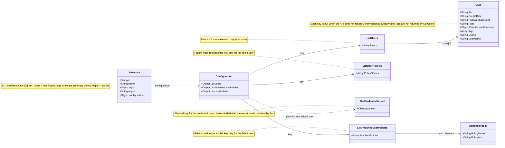

# IAM User Config Keys

```mermaid
classDiagram
    direction LR

    class Resource {
        +String id
        +String name
        +Object tags
        +String region
        +Object configuration
    }

    class Configuration {
        +Object ListUsers
        +Object ListAttachedUserPolicies
        +Object ListUserPolicies
    }

    class ListUsers {
        +Array Users
    }

    class User {
        +String Arn
        +String CreateDate
        +String PasswordLastUsed
        +String Path
        +Object PermissionsBoundary
        +Array Tags
        +String UserId
        +String UserName
    }

    class ListAttachedUserPolicies {
        +Array AttachedPolicies
    }

    class AttachedPolicy {
        +String PolicyName
        +String PolicyArn
    }

    class ListUserPolicies {
        +Array PolicyNames
    }

    class GetCredentialReport {
        +Object planned
    }

    note for Resource "id = ListUsers.Users[0].Arn. name = UserName. tags is always an empty object. region = global"
    note for ListUsers "Users holds one element only (that user)"
    note for User "Each key is null when the API does not return it. PermissionsBoundary and Tags are not returned by ListUsers"
    note for ListAttachedUserPolicies "Failure mark replaces this key only for the failed user"
    note for ListUserPolicies "Failure mark replaces this key only for the failed user"
    note for GetCredentialReport "Planned key for the credential report Issue. Added after the report row is matched by Arn"

    Resource --> Configuration : configuration
    Configuration --> ListUsers : key
    ListUsers --> User : Users[0]
    Configuration --> ListAttachedUserPolicies : key
    Configuration --> ListUserPolicies : key
    Configuration ..> GetCredentialReport : planned key, added later
    ListAttachedUserPolicies --> AttachedPolicy : each element
```
