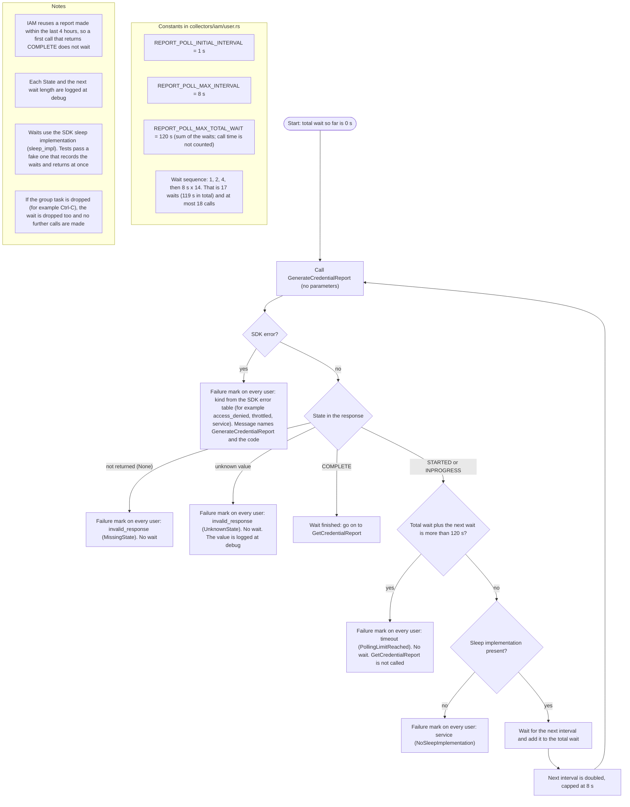

# IAM Credential Report Generation Polling

```mermaid
flowchart TD
    start(["Start: total wait so far is 0 s"]) --> gcall["Call GenerateCredentialReport (no parameters)"]
    gcall --> gcallf{"SDK error?"}
    gcallf -->|yes| mark_sdk["Failure mark on every user: kind from the SDK error table (for example access_denied, throttled, service). Message names GenerateCredentialReport and the code"]
    gcallf -->|no| gst{"State in the response"}
    gst -->|"not returned (None)"| mark_missing["Failure mark on every user: invalid_response (MissingState). No wait"]
    gst -->|"unknown value"| mark_unknown["Failure mark on every user: invalid_response (UnknownState). No wait. The value is logged at debug"]
    gst -->|COMPLETE| done["Wait finished: go on to GetCredentialReport"]
    gst -->|"STARTED or INPROGRESS"| lim{"Total wait plus the next wait is more than 120 s?"}
    lim -->|yes| timeout["Failure mark on every user: timeout (PollingLimitReached). No wait. GetCredentialReport is not called"]
    lim -->|no| sleep{"Sleep implementation present?"}
    sleep -->|no| mark_nosleep["Failure mark on every user: service (NoSleepImplementation)"]
    sleep -->|yes| wait["Wait for the next interval and add it to the total wait"]
    wait --> nxt["Next interval is doubled, capped at 8 s"]
    nxt --> gcall

    subgraph consts ["Constants in collectors/iam/user.rs"]
        c_init["REPORT_POLL_INITIAL_INTERVAL = 1 s"]
        c_max["REPORT_POLL_MAX_INTERVAL = 8 s"]
        c_total["REPORT_POLL_MAX_TOTAL_WAIT = 120 s (sum of the waits; call time is not counted)"]
        c_seq["Wait sequence: 1, 2, 4, then 8 s x 14. That is 17 waits (119 s in total) and at most 18 calls"]
    end

    subgraph notes ["Notes"]
        n_reuse["IAM reuses a report made within the last 4 hours, so a first call that returns COMPLETE does not wait"]
        n_debug["Each State and the next wait length are logged at debug"]
        n_sleep["Waits use the SDK sleep implementation (sleep_impl). Tests pass a fake one that records the waits and returns at once"]
        n_drop["If the group task is dropped (for example Ctrl-C), the wait is dropped too and no further calls are made"]
    end
```
