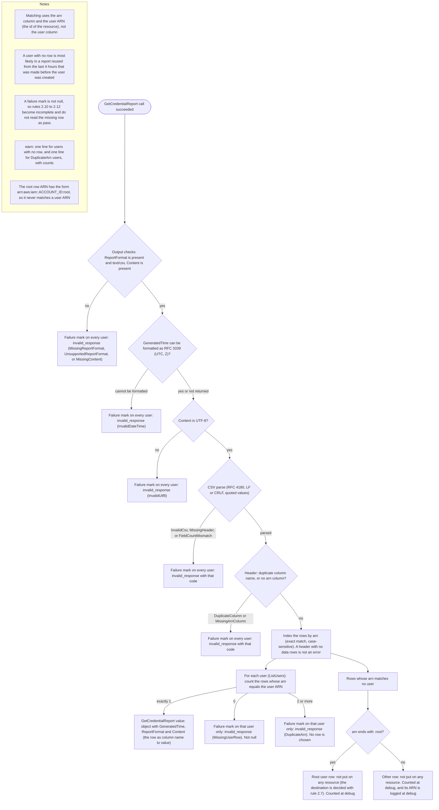

# IAM Credential Report Row Mapping

```mermaid
flowchart TD
    gok(["GetCredentialReport call succeeded"]) --> chk{"Output checks: ReportFormat is present and text/csv, Content is present"}
    chk -->|no| mark_out["Failure mark on every user: invalid_response (MissingReportFormat, UnsupportedReportFormat, or MissingContent)"]
    chk -->|yes| gtc{"GeneratedTime can be formatted as RFC 3339 (UTC, Z)?"}
    gtc -->|"cannot be formatted"| mark_dt["Failure mark on every user: invalid_response (InvalidDateTime)"]
    gtc -->|"yes or not returned"| utf{"Content is UTF-8?"}
    utf -->|no| mark_utf["Failure mark on every user: invalid_response (InvalidUtf8)"]
    utf -->|yes| csv{"CSV parse (RFC 4180, LF or CRLF, quoted values)"}
    csv -->|"InvalidCsv, MissingHeader, or FieldCountMismatch"| mark_csv["Failure mark on every user: invalid_response with that code"]
    csv -->|parsed| hdr{"Header: duplicate column name, or no arn column?"}
    hdr -->|"DuplicateColumn or MissingArnColumn"| mark_hdr["Failure mark on every user: invalid_response with that code"]
    hdr -->|no| idx["Index the rows by arn (exact match, case-sensitive). A header with no data rows is not an error"]

    idx --> uq["For each user (ListUsers): count the rows whose arn equals the user ARN"]
    uq -->|"exactly 1"| val["GetCredentialReport value: object with GeneratedTime, ReportFormat and Content (the row as column name to value)"]
    uq -->|"0"| miss["Failure mark on that user only: invalid_response (MissingUserRow). Not null"]
    uq -->|"2 or more"| dup["Failure mark on that user only: invalid_response (DuplicateArn). No row is chosen"]

    idx --> rest["Rows whose arn matches no user"]
    rest --> rq{"arn ends with :root?"}
    rq -->|yes| rroot["Root user row: not put on any resource (the destination is decided with rule 2.7). Counted at debug"]
    rq -->|no| rother["Other row: not put on any resource. Counted at debug, and its ARN is logged at debug"]

    subgraph notes ["Notes"]
        n_match["Matching uses the arn column and the user ARN (the id of the resource), not the user column"]
        n_missing["A user with no row is most likely in a report reused from the last 4 hours that was made before the user was created"]
        n_mark["A failure mark is not null, so rules 2.10 to 2.12 become incomplete and do not read the missing row as pass"]
        n_warn["warn: one line for users with no row, and one line for DuplicateArn users, with counts"]
        n_root["The root row ARN has the form arn:aws:iam::ACCOUNT_ID:root, so it never matches a user ARN"]
    end
```
