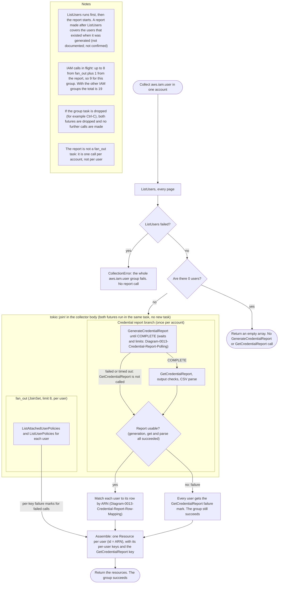

# IAM User Collector Concurrency

```mermaid
flowchart TD
    start(["Collect aws.iam.user in one account"]) --> lu["ListUsers, every page"]
    lu --> luf{"ListUsers failed?"}
    luf -->|yes| ce["CollectionError: the whole aws.iam.user group fails. No report call"]
    luf -->|no| cnt{"Are there 0 users?"}
    cnt -->|yes| empty(["Return an empty array. No GenerateCredentialReport or GetCredentialReport call"])
    subgraph join ["tokio::join! in the collector body (both futures run in the same task, no new task)"]
        subgraph fan ["fan_out (JoinSet, limit 8, per user)"]
            f1["ListAttachedUserPolicies and ListUserPolicies for each user"]
        end
        subgraph rep ["Credential report branch (once per account)"]
            r1["GenerateCredentialReport until COMPLETE (waits and limits: Diagram-0013-Credential-Report-Polling)"]
            r2["GetCredentialReport, output checks, CSV parse"]
            r3{"Report usable? (generation, get and parse all succeeded)"}
            r1 -->|"COMPLETE"| r2
            r1 -->|"failed or timed out: GetCredentialReport is not called"| r3
            r2 --> r3
        end
    end

    cnt -->|no| join

    r3 -->|yes| rowmap["Match each user to its row by ARN (Diagram-0013-Credential-Report-Row-Mapping)"]
    r3 -->|"no: failure"| rmark["Every user gets the GetCredentialReport failure mark. The group still succeeds"]
    f1 -->|"per-key failure marks for failed calls"| asm["Assemble: one Resource per user (id = ARN), with its per-user keys and the GetCredentialReport key"]
    rowmap --> asm
    rmark --> asm
    asm --> done(["Return the resources. The group succeeds"])

    subgraph notes ["Notes"]
        n_order["ListUsers runs first, then the report starts. A report made after ListUsers covers the users that existed when it was generated (not documented; not confirmed)"]
        n_count["IAM calls in flight: up to 8 from fan_out plus 1 from the report, so 9 for this group. With the other IAM groups the total is 19"]
        n_drop["If the group task is dropped (for example Ctrl-C), both futures are dropped and no further calls are made"]
        n_nofan["The report is not a fan_out task: it is one call per account, not per user"]
    end
```
