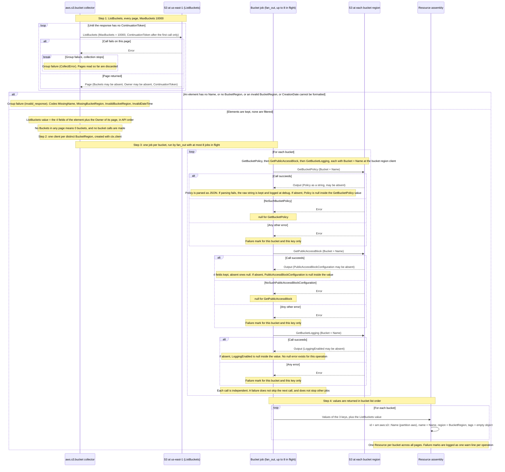

# S3 Bucket Collection Sequence

```mermaid
sequenceDiagram
    participant C as aws.s3.bucket collector
    participant SU as S3 at us-east-1 (ListBuckets)
    participant J as Bucket job (fan_out, up to 8 in flight)
    participant SB as S3 at each bucket region
    participant R as Resource assembly

    Note over C,SU: Step 1: ListBuckets, every page, MaxBuckets 10000
    loop Until the response has no ContinuationToken
        C->>SU: ListBuckets (MaxBuckets = 10000, ContinuationToken after the first call only)
        alt Call fails on this page
            SU-->>C: Error
            break Group failure, collection stops
                Note over C: Group failure (CollectError). Pages read so far are discarded
            end
        else Page returned
            SU-->>C: Page (Buckets may be absent, Owner may be absent, ContinuationToken)
        end
    end

    alt An element has no Name, or no BucketRegion, or an invalid BucketRegion, or CreationDate cannot be formatted
        Note over C: Group failure (invalid_response). Codes MissingName, MissingBucketRegion, InvalidBucketRegion, InvalidDateTime
    else Elements are kept, none are filtered
        Note over C: ListBuckets value = the 4 fields of the element plus the Owner of its page, in API order
        Note over C: No Buckets in any page means 0 buckets, and no bucket calls are made

        Note over C: Step 2: one client per distinct BucketRegion, created with ctx.client
        Note over C,J: Step 3: one job per bucket, run by fan_out with at most 8 jobs in flight

        loop For each bucket
            Note over J,SB: GetBucketPolicy, then GetPublicAccessBlock, then GetBucketLogging, each with Bucket = Name at the bucket region client
            J->>SB: GetBucketPolicy (Bucket = Name)
            alt Call succeeds
                SB-->>J: Output (Policy as a string, may be absent)
                Note over J: Policy is parsed as JSON. If parsing fails, the raw string is kept and logged at debug. If absent, Policy is null inside the GetBucketPolicy value
            else NoSuchBucketPolicy
                SB-->>J: Error
                Note over J: null for GetBucketPolicy
            else Any other error
                SB-->>J: Error
                Note over J: Failure mark for this bucket and this key only
            end

            J->>SB: GetPublicAccessBlock (Bucket = Name)
            alt Call succeeds
                SB-->>J: Output (PublicAccessBlockConfiguration may be absent)
                Note over J: 4 fields kept, absent ones null. If absent, PublicAccessBlockConfiguration is null inside the value
            else NoSuchPublicAccessBlockConfiguration
                SB-->>J: Error
                Note over J: null for GetPublicAccessBlock
            else Any other error
                SB-->>J: Error
                Note over J: Failure mark for this bucket and this key only
            end

            J->>SB: GetBucketLogging (Bucket = Name)
            alt Call succeeds
                SB-->>J: Output (LoggingEnabled may be absent)
                Note over J: If absent, LoggingEnabled is null inside the value. No null error exists for this operation
            else Any error
                SB-->>J: Error
                Note over J: Failure mark for this bucket and this key only
            end

            Note over J: Each call is independent. A failure does not skip the next call, and does not stop other jobs
        end

        Note over J,R: Step 4: values are returned in bucket list order
        loop For each bucket
            J->>R: Values of the 3 keys, plus the ListBuckets value
            R->>R: id = arn:aws:s3:::Name (partition aws), name = Name, region = BucketRegion, tags = empty object
        end
        Note over R: One Resource per bucket across all pages. Failure marks are logged as one warn line per operation
    end
```
