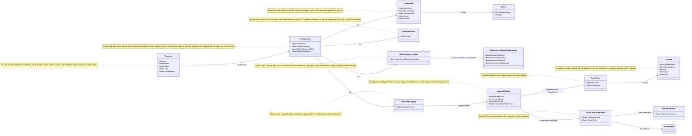

# S3 Bucket Configuration Keys

```mermaid
classDiagram
    direction LR

    class Resource {
        +String id
        +String name
        +String region
        +Object tags
        +Object configuration
    }

    class Configuration {
        +Object ListBuckets
        +Object GetBucketPolicy
        +Object GetPublicAccessBlock
        +Object GetBucketLogging
    }

    class ListBuckets {
        +String BucketArn
        +String BucketRegion
        +String CreationDate
        +String Name
        +Object Owner
    }

    class Owner {
        +String DisplayName
        +String ID
    }

    class GetBucketPolicy {
        +Object Policy
    }

    class GetPublicAccessBlock {
        +Object PublicAccessBlockConfiguration
    }

    class PublicAccessBlockConfiguration {
        +Boolean BlockPublicAcls
        +Boolean BlockPublicPolicy
        +Boolean IgnorePublicAcls
        +Boolean RestrictPublicBuckets
    }

    class GetBucketLogging {
        +Object LoggingEnabled
    }

    class LoggingEnabled {
        +String TargetBucket
        +Array TargetGrants
        +String TargetPrefix
        +Object TargetObjectKeyFormat
    }

    class TargetGrant {
        +Object Grantee
        +String Permission
    }

    class Grantee {
        +String DisplayName
        +String EmailAddress
        +String ID
        +String Type
        +String URI
    }

    class TargetObjectKeyFormat {
        +Object PartitionedPrefix
        +Object SimplePrefix
    }

    class PartitionedPrefix {
        +String PartitionDateSource
    }

    class SimplePrefix {
    }

    note for Resource "id = arn:aws:s3:::Name from the format, not BucketArn. name = Name. region = BucketRegion. tags is always an empty object"
    note for Configuration "Fields inside each value are null when the API does not return them. A key is null only for the errors noted on that key. A failure mark replaces only the failed key of one bucket"
    note for ListBuckets "Element of the Buckets list plus the Owner of its page. Owner is null when the page did not return it"
    note for GetBucketPolicy "Whole output. The key itself is null for NoSuchBucketPolicy. Policy is a parsed JSON object, or the raw string when not JSON, or null when absent"
    note for GetPublicAccessBlock "Whole output. The key itself is null for NoSuchPublicAccessBlockConfiguration. PublicAccessBlockConfiguration is null when absent"
    note for GetBucketLogging "Whole output. LoggingEnabled is null when logging is off. No null error exists for this operation"
    note for TargetGrant "Element of TargetGrants. TargetGrants is null when absent"
    note for LoggingEnabled "TargetBucket and TargetPrefix are always strings. The SDK fills an empty string when the API omits them"
    note for Grantee "Grantee is null when absent. Type is always a string. The SDK fills no value was set when the API omits it"
    note for TargetObjectKeyFormat "SimplePrefix is an empty object when returned, null when absent"

    Resource --> Configuration : configuration
    Configuration --> ListBuckets : key
    Configuration --> GetBucketPolicy : key
    Configuration --> GetPublicAccessBlock : key
    Configuration --> GetBucketLogging : key
    ListBuckets --> Owner : Owner
    GetPublicAccessBlock --> PublicAccessBlockConfiguration : PublicAccessBlockConfiguration
    GetBucketLogging --> LoggingEnabled : LoggingEnabled
    LoggingEnabled --> TargetGrant : each element of TargetGrants
    TargetGrant --> Grantee : Grantee
    LoggingEnabled --> TargetObjectKeyFormat : TargetObjectKeyFormat
    TargetObjectKeyFormat --> PartitionedPrefix : PartitionedPrefix
    TargetObjectKeyFormat --> SimplePrefix : SimplePrefix
```
