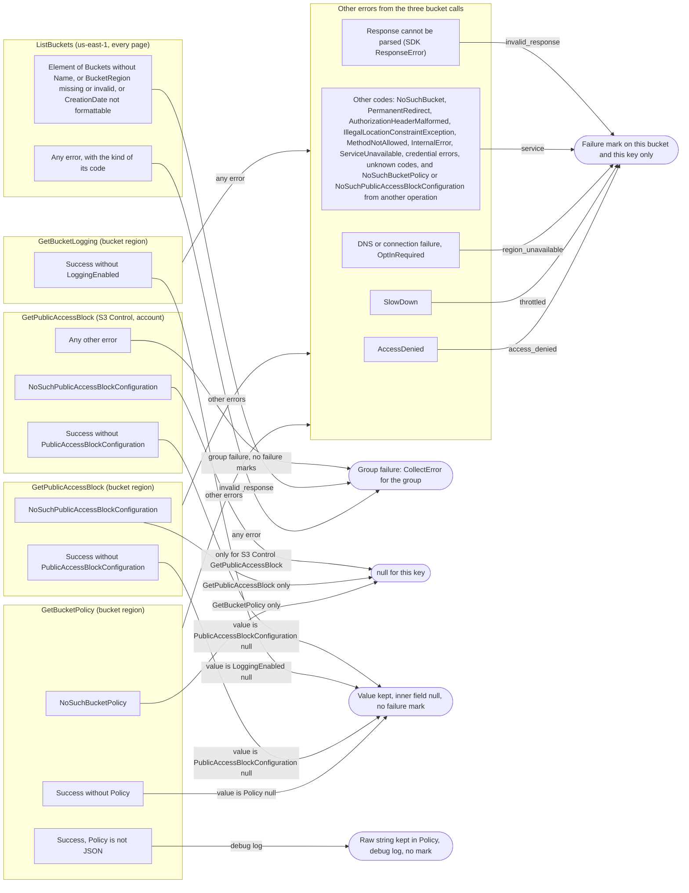

# S3 Error Routing by Operation

```mermaid
flowchart LR
    GF(["Group failure: CollectError for the group"])
    MK(["Failure mark on this bucket and this key only"])
    NL(["null for this key"])
    VK(["Value kept, inner field null, no failure mark"])
    RAW(["Raw string kept in Policy, debug log, no mark"])

    subgraph LB["ListBuckets (us-east-1, every page)"]
        L1["Any error, with the kind of its code"]
        L2["Element of Buckets without Name, or BucketRegion missing or invalid, or CreationDate not formattable"]
    end

    subgraph GP["GetBucketPolicy (bucket region)"]
        P1["NoSuchBucketPolicy"]
        P2["Success without Policy"]
        P3["Success, Policy is not JSON"]
    end

    subgraph GA["GetPublicAccessBlock (bucket region)"]
        A1["NoSuchPublicAccessBlockConfiguration"]
        A2["Success without PublicAccessBlockConfiguration"]
    end

    subgraph GL["GetBucketLogging (bucket region)"]
        G1["Success without LoggingEnabled"]
    end

    subgraph CM["Other errors from the three bucket calls"]
        C1["AccessDenied"]
        C2["SlowDown"]
        C3["DNS or connection failure, OptInRequired"]
        C4["Other codes: NoSuchBucket, PermanentRedirect, AuthorizationHeaderMalformed, IllegalLocationConstraintException, MethodNotAllowed, InternalError, ServiceUnavailable, credential errors, unknown codes, and NoSuchBucketPolicy or NoSuchPublicAccessBlockConfiguration from another operation"]
        C5["Response cannot be parsed (SDK ResponseError)"]
    end

    subgraph SC["GetPublicAccessBlock (S3 Control, account)"]
        S1["NoSuchPublicAccessBlockConfiguration"]
        S2["Any other error"]
        S3["Success without PublicAccessBlockConfiguration"]
    end

    L1 -->|"any error"| GF
    L2 -->|"invalid_response"| GF

    P1 -->|"GetBucketPolicy only"| NL
    P2 -->|"value is Policy null"| VK
    P3 -->|"debug log"| RAW

    A1 -->|"GetPublicAccessBlock only"| NL
    A2 -->|"value is PublicAccessBlockConfiguration null"| VK

    G1 -->|"value is LoggingEnabled null"| VK

    GP -->|"other errors"| CM
    GA -->|"other errors"| CM
    GL -->|"any error"| CM

    C1 -->|"access_denied"| MK
    C2 -->|"throttled"| MK
    C3 -->|"region_unavailable"| MK
    C4 -->|"service"| MK
    C5 -->|"invalid_response"| MK

    S1 -->|"only for S3 Control GetPublicAccessBlock"| NL
    S2 -->|"group failure, no failure marks"| GF
    S3 -->|"value is PublicAccessBlockConfiguration null"| VK
```
