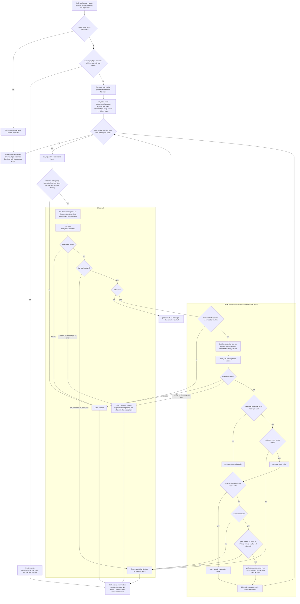

# Per-Resource Evaluation

```mermaid
flowchart TD
    start["Rule and account reach evaluation (status steps 1 and 2 passed)"] --> n0{"target_type has 0 resources?"}
    n0 -->|yes| none["No evaluation. No data added. 0 results"]
    n0 -->|no| dup{"Two target_type resources with the same id and region?"}
    dup -->|yes| eint["Error (internal): DuplicateResource. Stop this rule and account"]
    dup -->|no| clone["Clone the rule engine (base engine with the libraries)"]
    clone --> add["add_data once: yata.context (account, regions) and every declared type array, sorted by id then region"]
    add --> next{"Next target_type resource in id then region order?"}
    next -->|no| after["All resources evaluated. One result per resource. Continue with status steps 4 to 6"]
    next -->|yes| set["set_input: this resource as input"]
    set --> tl{"Time limit left? (policy timeout minus time since the rule and account started)"}
    tl -->|no| eto["Error: timeout"]
    tl -->|yes| lim["Set the remaining time as the execution timer limit before each eval_rule call"]

    subgraph failcheck["Check fail"]
        lim --> evf["eval_rule data.yata.rules.ID.fail"]
        evf --> ferr{"Evaluation error?"}
        ferr -->|timeout| eto
        ferr -->|conflict or other regorus error| eeng["Error: conflict or engine (regorus message kept, not shown in the description)"]
        ferr -->|no| fbool{"fail is a boolean?"}
        fbool -->|no, undefined or other type| etype["Error: type (fail undefined or not a boolean)"]
        fbool -->|yes| fv{"fail is true?"}
    end

    fv -->|no| passr["pass result: no message, path, actual, expected"]

    subgraph detail["Read message and reason (only when fail is true)"]
        fv -->|yes| tl2{"Time limit left? (same check as before fail)"}
        tl2 -->|no| eto
        tl2 -->|yes| lim2["Set the remaining time as the execution timer limit before each eval_rule call"]
        lim2 --> mr["eval_rule message and reason"]
        mr --> merr{"Evaluation error?"}
        merr -->|timeout| eto
        merr -->|conflict or other regorus error| eeng
        merr -->|no| mdef{"message undefined or no message rule?"}
        mdef -->|yes| title["message = metadata title"]
        mdef -->|no| mtype{"message a non-empty string?"}
        mtype -->|no| etype
        mtype -->|yes| mval["message = the value"]
        title --> rdef{"reason undefined or no reason rule?"}
        mval --> rdef
        rdef -->|yes| rnone["path, actual, expected = none"]
        rdef -->|no| robj{"reason an object?"}
        robj -->|no| etype
        robj -->|yes| rpath{"path absent, or a JSON Pointer string? (null is not allowed)"}
        rpath -->|no| etype
        rpath -->|yes| rval["path, actual, expected from reason (absent = none, null kept as null)"]
        rnone --> failr["fail result: message, path, actual, expected"]
        rval --> failr
    end

    passr --> next
    failr --> next
    none --> after
    eto --> rerr
    eeng --> rerr
    etype --> rerr
    eint --> rerr
    rerr["Rule status error for this rule and account. No results. Other accounts and rules continue"]
```
