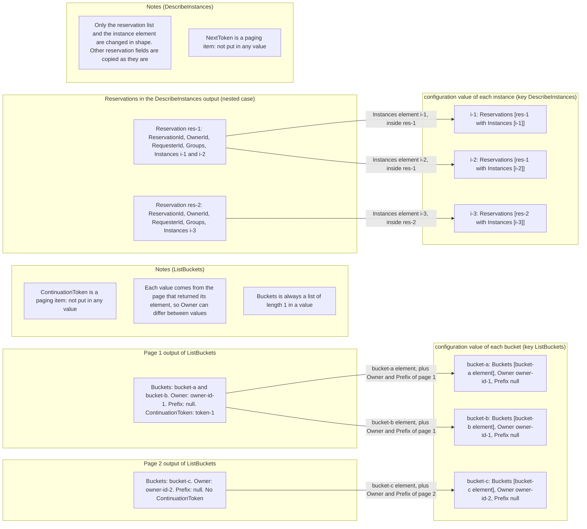

# Listing Operation Output Slicing

```mermaid
flowchart LR
    subgraph PG1["Page 1 output of ListBuckets"]
        P1["Buckets: bucket-a and bucket-b. Owner: owner-id-1. Prefix: null. ContinuationToken: token-1"]
    end

    subgraph PG2["Page 2 output of ListBuckets"]
        P2["Buckets: bucket-c. Owner: owner-id-2. Prefix: null. No ContinuationToken"]
    end

    subgraph VAL["configuration value of each bucket (key ListBuckets)"]
        R1["bucket-a: Buckets [bucket-a element], Owner owner-id-1, Prefix null"]
        R2["bucket-b: Buckets [bucket-b element], Owner owner-id-1, Prefix null"]
        R3["bucket-c: Buckets [bucket-c element], Owner owner-id-2, Prefix null"]
    end

    P1 -->|"bucket-a element, plus Owner and Prefix of page 1"| R1
    P1 -->|"bucket-b element, plus Owner and Prefix of page 1"| R2
    P2 -->|"bucket-c element, plus Owner and Prefix of page 2"| R3

    subgraph NOTE1["Notes (ListBuckets)"]
        N1["ContinuationToken is a paging item: not put in any value"]
        N2["Each value comes from the page that returned its element, so Owner can differ between values"]
        N3["Buckets is always a list of length 1 in a value"]
    end

    subgraph DI["Reservations in the DescribeInstances output (nested case)"]
        RV1["Reservation res-1: ReservationId, OwnerId, RequesterId, Groups, Instances i-1 and i-2"]
        RV2["Reservation res-2: ReservationId, OwnerId, RequesterId, Groups, Instances i-3"]
    end

    subgraph IV["configuration value of each instance (key DescribeInstances)"]
        I1["i-1: Reservations [res-1 with Instances [i-1]]"]
        I2["i-2: Reservations [res-1 with Instances [i-2]]"]
        I3["i-3: Reservations [res-2 with Instances [i-3]]"]
    end

    RV1 -->|"Instances element i-1, inside res-1"| I1
    RV1 -->|"Instances element i-2, inside res-1"| I2
    RV2 -->|"Instances element i-3, inside res-2"| I3

    subgraph NOTE2["Notes (DescribeInstances)"]
        N4["Only the reservation list and the instance element are changed in shape. Other reservation fields are copied as they are"]
        N5["NextToken is a paging item: not put in any value"]
    end
```
